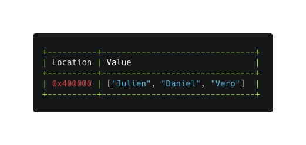
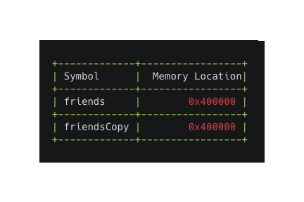
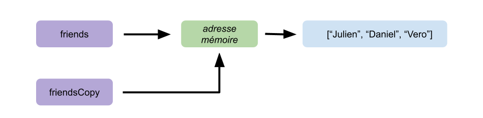

Hello 🖖,  
Dans cet article je vais tenter d’expliquer quelques points qui me semblent intéressants en JavaScript, et qui sont souvent mal compris, voir inconnus pour certains. Vous êtes prêts ? C’est parti pour le sommaire.

## Sommaire

-   Valeurs & Références
-   Auto-Boxing
-   JavaScript, interprété ou compilé ?
-   Hoisting

Tu ne connais pas certains de ces mots ? Alors tu es au bon endroit 😁

**🔍 Pour bien comprendre ce qui va suivre :**  
En JavaScript, les types primitifs sont écrits en minuscule et les types complexes sont écrits avec une majuscule au début.  
Exemple:  
-  _string_  représente la variable primitive d’une chaîne de caractère.  
-  _String_  représente la version Objet d’une chaîne de caractère.

Vous ne saisissez pas la nuance ? J’en parle un peu plus loin, ne vous inquiétez pas. Maintenant que nous avons les bases pour la compréhension, on peut commencer 🚀.

# Valeurs & Références

_Ce sujet n’est pas un point obscur du fonctionnement de JavaScript, mais je rencontre souvent des développeurs juniors qui n’ont pas bien compris son fonctionnement._

En JavaScript, les variables sont passées par valeurs ou par références.  
Cela dépend du type de ces variables.

Pour comprendre cela, il est important de distinguer deux genres de variables:

-   **Variables primitives:**  string, number, boolean, undefined, null.  
	  💡 On dit primitives car elles sont “simples”, elles ne contiennent qu’une seule valeur.
	  
-   **Variables complexes:**  Object, Array, Map, Set...  
    💡 On dit complexes car elles sont capables de stocker de multiples valeurs.  
    
    ⚠️ En JavaScript, toutes les variables complexes sont des Objets.  
    Les  *Array, Map, Set,* etc... ne sont pas des types, mais des instances de  _Object.  
    Elles possèdent un prototype propre à leurs instances, et héritent du prototype de  *Object.*

## Variables primitives

Les variables primitives sont assignées par valeurs. Cela signifie que lorsqu’on passe la valeur à une autre variable, la valeur est copiée.

```javascript
// Creation d'une variable primitive string  
let name = "Alexandre"

// Copie de la valeur  
let nameCopy = name

console.log(name) // "Alexandre"
console.log(nameCopy) // "Alexandre"

// Modification de la variable initiale
name = "Alex"

console.log(name) // "Alex"
console.log(nameCopy) // "Alexandre"
```

La variable “nameCopy” n’a pas été affectée par la modification de la variable “name”, car elles n’ont pas de lien entre elles, elles sont isolées l’une de l’autre.

## Variables complexes

Pour les variables complexes, le comportement est différent.  
La valeur est passée par référence.

Prenons cet exemple:

```javascript
// Creation d'un Array de strings  
let friends = ["Julien", "Daniel", "Vero"]
```

Nous déclarons la variable “friends” et nous lui assignons un  _Array_.  
Que se passe t’il quand ce code est exécuté par notre moteur JavaScript ?

Cet  _Array_ va être stocké dans la mémoire (Heap) à une adresse mémoire spécifique (Location)

   

Une fois cela fait, la variable “friends” a comme valeur non pas l’_Array_, mais bien la  **référence**  à cet  _Array_  stocké dans la mémoire.


C’est pourquoi lorsque nous tentons de copier cette valeur, comme ci-dessous:

```javascript
// Création d'un Array de strings  
let friends = ["Julien", "Daniel", "Vero"]

// Tentative de copie de l'Array  
let friendsCopy = friends
```
Nous ne faisons que copier la  **référence**  vers  _l’ Array_,  **pas la valeur elle même**.  
Les deux variables pointent vers la même adresse mémoire, là où est stocké notre fameux  _Array_.





Les variables “friends” et “friendsCopy" utilisent donc la même référence. Ce qui signifie que si la valeur stockée change (notre  _Array)_, elle change pour toutes les deux.

```javascript
// Creation d'un Array de strings  
let friends = ["Julien", "Daniel", "Vero"]

// Tentative de copie de l'Array  
let friendsCopy = friends

// Ajout de "toto" dans friendsCopy
friendsCopy.push("toto")  

console.log(friends) // ["Julien", "Daniel", "Vero", "toto"]  
console.log(friendsCopy) // ["Julien", "Daniel", "Vero", "toto"]

// Les deux variables ont été modifiées  
// Pas seulement "friends"
```

Si vous avez besoin de faire une véritable copie de votre variable complexe, sans utiliser de référence donc, c’est possible.

On parle de  **Shallow copy** et de **Deep Copy.**

-   **Shallow Copy:**  Création d’un nouvel Objet, tout en gardant les éléments enfants en tant que référence (si les éléments enfants sont complexes, sinon par valeur comme nous l’avons vu).

-   **Deep Copy**: L’Objet et tous ses enfants sont copiés par valeur, cela nécessite d’utiliser une fonction récursive.

Dans notre cas c’est facile, “friends” est un tableau de  _string_, de valeurs primitives donc. Avec le  [spread operator](https://developer.mozilla.org/fr/docs/Web/JavaScript/Reference/Op%C3%A9rateurs/Syntaxe_d%C3%A9composition)  (ES6), il est facilement possible de copier ces valeurs et de “casser” la référence entre les deux variables.
```javascript
// Creation d'un Array de strings  
let friends = ["Julien", "Daniel", "Vero"]

// Copie du l'Array  
let friendsCopy = [...friends]

// Ajout de "toto" dans friendsCopy
friendsCopy.push("toto")

console.log(friends) // ["Julien", "Daniel", "Vero"]
console.log(friendsCopy) // ["Julien", "Daniel", "Vero", "toto"]
```

# Auto-Boxing

Dans la partie précédente, je dis que le language contient des variables primitives et complexes (Object).  
Par définition, une variable primitive est une valeur brute dans la mémoire, elle n’a pas de prototype, pas de méthode... bref juste une valeur.

Pourtant ceci fonctionne:
```javascript
"toto".toUpperCase() // TOTO
```

<p align="center">

</p>

Quelle est donc cette sorcellerie ?  
Comment peut-on accéder à cette méthode “toUpperCase" si ma variable ne contient rien de plus qu’une chaîne de caractères ?

Cela signifie t’il que ces “soit-disant primitives” sont en réalité des Objets ?

On pourrait y croire, oui … mais non. 🤓  
  
Pour bien comprendre, il faut savoir que les primitives s_tring, number, boolean_  peuvent être initialisées de trois manières différentes:

-   Littérale
-   Constructeur

-   new + Constructeur

```javascript
// Litérale  
const name = "Alex"
const age = 27
const isTrue = true 

// Constructeur  
const name = String("Alex")
const age = Number(27)
const isTrue = Boolean(true)

// new + Constructeur  
const name = new String("Alex")
const age = new Number(27)
const isTrue = new Boolean(true)
```

La manière littérale et celle par constructeur reviennent exactement à la même chose.
```javascript
"ma chaine" === String("ma chaine") // true
```
Ce n’est pas le cas pour la création avec l’opérateur “new”.
```javascript
"ma chaine" === new String("ma chaine") // false
```
  
Il en résulte un  _Object_. Un objet de type  _String_  dans notre exemple.  
L’objet créé contient un prototype  _String_  avec toutes les méthodes qui lui sont propres (voir \__proto__\).


Cela étant précisé, comment avez-vous accès aux prototypes d’une variable primitive créée sans l’opérateur “new” ?  
Et bien ça, c’est dû à la magie de l’**Auto-boxing** dans JavaScript.  
Ce principe existe dans d’autres langages comme C++ ou Java entre autres.  
Lorsqu’on tente d’accéder à une méthode sur une primitive, JavaScript effectue automatiquement la conversion entre la primitive et la version Objet de cette primitive. La chaîne est temporairement transformée en un Objet le temps du traitement, puis ce dernier est détruit.

Pour résumer, lorsque l’on écrit:
```javascript
const str = "toto"

str.toUpperCase()
```

Au moment d’exécuter “str.toUpperCase()”, JavaScript va caster “str” en  **new String(str).**  
Ensuite, on cherche dans la  [chaîne de prototypes](https://developer.mozilla.org/fr/docs/Web/JavaScript/H%C3%A9ritage_et_cha%C3%AEne_de_prototypes) la méthode  **upperCase**.  
Si elle est trouvée, elle est exécutée, et on supprime l’Objet temporaire.

Tout n’est pas objet en JavaScript, il y a bien des primitives.  
Une phrase plus correcte pourrait être “Tout est traité comme un Objet en JavaScript”, car en effet grâce à l’Auto-Boxing, même les primitives peuvent être traitées comme des Objets.

# JavaScript, interprété ou compilé ?

Alors, votre réponse ? 🙃
<p align="center">

</p>


TL;DR Compilé à la volée.

Lors des premières années du langage, quand son utilisation se limitait à quelques modifications du DOM tout au plus, le JavaScript était  **interprété**  par les navigateurs.

Bien que la compilation permette une plus rapide exécution du code, l’interprétation, plus simple, fournissait des performances adéquates aux cas d’utilisation de l’époque.

Cependant, dans les années 2000, la course à la performance des navigateurs Web fait rage et les principaux acteurs (Mozilla, Google) essaient d’optimiser leurs navigateurs au maximum.

Ainsi, Firefox dévoile SpiderMonkey, le tout premier compilateur  **JIT** qui a permis un gain de performance de l’ordre de 20 à 40% comparé à l’ancienne version du moteur JavaScript.

Dans la foulée, Google met à disposition le navigateur Chrome et son moteur d’exécution  [V8](https://v8.dev/docs), incluant lui aussi un compilateur  **JIT**.

La compilation JIT (alias: “Just in Time”, “JIT”, ou encore “Compilation à la volée”) est un compromis entre l’interprétation est la compilation.

Pour résumer, le JavaScript exécuté dans  [Node.js](https://nodejs.org/en/)  ainsi que dans la majorité des navigateurs web est compilé à la volée (alias: “Just in Time”, “JIT”).

Si ce fonctionnement vous intrigue ,je vous invite à lire cet  [article sur la compilation à la volée](https://tech.mozfr.org/post/2017/03/08/Un-petit-cours-accelere-de-compilation-a-la-volee-%28JIT%29), qui explique très bien !

# Hoisting

Le code que vous écrivez n’est pas toujours interprété comme on l’imagine.

En effet, dans le moteur JavaScript V8 qui est utilisé dans Chrome, Node.js, mais aussi ailleurs, il y a une rapide phase de compilation au runtime avant l’exécution du code. (Vous le savez si vous avez lu le chapitre juste au-dessus 😉). Pendant cette compilation, toutes les déclarations de variables et de fonctions sont détectées, créées en mémoire et de l’espace leur est attribué. Schématiquement, cela revient à imaginer que les déclarations de fonctions et les déclarations de variables à l’aide du mot clef “var” (pas “const” ni “let”, nous verrons pourquoi plus tard) sont remontées dans le code.  
On appelle cela le  **Hoisting**. (Le  _Hissage_  en français... mais personne ne le dit 😄).

```javascript
console.log(x) // undefined  
var x = "toto"
```

Dans cet exemple, on pourrait s’attendre à ce que le  _console.log_  nous renvoie l’erreur suivante:  _Uncaught ReferenceError: x is not defined_  
Vu que  _x_  n’a pas été déclaré.  
Et pourtant ce n’est pas le cas, grâce au Hoisting. Après compilation, le code est plutôt interprété de cette manière:

```javascript
// Declaration   
var x

console.log(x) // undefined

// Assignation 
x = "toto"
```

La déclaration de la variable  _x_ a été remontée.  
Au moment du  _console.log_, la variable est bien déclarée et a pour valeur _undefined._ Ensuite la valeur “toto” lui est assignée.

Il faut bien comprendre que le Hoisting de variables ne prend en compte que la  **déclaration**, et non pas l’assignation (la valeur). L’assignation reste à l’endroit où vous l’avez écrite.

Autre exemple:

```javascript
x = "toto"

console.log(x)

var x
```

Ce code est correct, et  _x_  n’est pas défini globalement comme on pourrait le penser. Cette variable  _x_  est bien remontée pendant le hoisting avant l’assignation.

## Changement depuis ES6

Depuis ES6 (ECMAScript 2015), il n’est plus courant d’utiliser le mot clef “var” pour créer nos variables.  
Ce dernier a été remplacé par les mots clefs “let” et “const” qui nous permettent d’avoir nos variables scopées par block.

Le comportement est plus strict avec ces nouveaux mots clefs.  
Les variables doivent obligatoirement être déclarées avant d’être appelées. Dans le cas contraire, JavaScript nous renvoie une  _ReferenceError._ Cela nous oblige à toujours déclarer nos variables avant de s’en servir.

```javascript
console.log(x)   
// ReferenceError: Cannot access 'x' before initialization

let x = "toto"
```

Vous comprendrez donc que dans le JavaScript moderne, qui n’utilise plus de “var”, il n’y a plus de hoisting.  
Et bien pas tout à fait, car les définitions de fonctions le sont toujours.

```javascript
greetings() // hello

function greetings() {  
   console.log("hello")  
}
```

A noter que ce n’est pas le cas pour les expressions de fonctions.

```javascript
greetings() // ReferenceError  
let greetings = () => console.log("hello")
```

## Voilà, c’est fini !

Cela termine mon premier article, j’espère qu’il vous a été utile.  
N’hésitez pas à mettre un commentaire si vous avez une suggestion ️😁  
A bientôt !