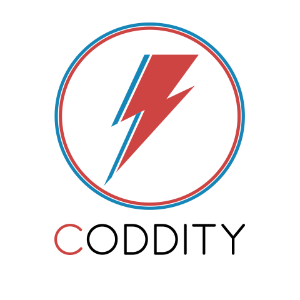

#Data is the new oil

Aujourd’hui, la stratégie digitale marketing repose sur **quatre piliers** que sont **l’acquisition** de nouveaux prospects, la **conversion** en clients, leur **rétention** et leur **fidélisation**. Quelle que soit la stratégie mise en place, les leviers d’actions sont multiples : SEO, référencement, publicité, email marketing, campagne SMS etc. L’optimisation de ces actions est donc un enjeu majeur.

L’utilisation des **données massives** et des techniques du **Machine Learning** pour le marketing apportent un réel **avantage concurrentiel**. Les métiers du Marketing ont compris que le big data est un moyen d’**élargir leur panel de techniques** afin de mieux comprendre leurs clients et finalement d’en tirer un **réel bénéfice**.

##Le Machine Learning

Le Machine Learning s’appuie sur une **grande volumétrie de données** clients (navigation sur le site, interactions service client, âge, CSP, etc.) et permet d’exploiter **rapidement et automatiquement** de nombreuses variables pour bâtir des **modèles robustes et précis**. La notion d’**apprentissage**, au coeur de la technique, permet de s’adapter à la **réalité de l’historique** de votre entreprise et de votre **marché**. Il ne s’agit pas de proposer des règles qui permettent d’automatiser la valorisation de données mais d’**apprendre de ces dernières pour personnaliser les actions** et gagner en **pertinence** en fonction de vos besoins et de vos spécificités. Le besoin d’explication est aussi important que le besoin de décision et le Machine Learning apporte justement des éléments pour **interpreter les résultats obtenus**.

##Valorisation des données

Si la **connaissance client** est au coeur de la stratégie, la **base de données clients** est alors une vraie mine d’or qui ne demande qu’à être exploitée. Au-delà des actions marketing, la **valorisation** intrinsèque de ces données client est source de valeur ajoutée.

Et la bonne nouvelle, c'est que votre base clients est **déjà disponible**. Nul besoin d'acquérir de nouvelles données (pour l'instant). Alors, qu’attendez-vous ? 

## Les freins, ça freine

Attention au **phénomène de mode** ! Considérer que le **#Big Data**, la **#Data Science**, l'**#IA** apportent une réponse à tous les problèmes est une erreur. 

Le "buzz" généré autour de ces mots-clés est certainement un **frein à la réussite** des projets. En effet, le défi n’est pas uniquement technologique puisque les nouveaux outils créés grâce au ML doivent être **adoptés, et donc compris par leurs utilisateurs** ! L’approche doit être accompagnée d’une **conduite du changement** poussée et idéalement **impliquer les métiers** au plus tôt dans l’étude.

Nous vous proposons ici de démystifier ce qui se cache derrière ce nuage de hashtags et aborder quelques **cas d’usage concrets**.

Et si on découpait du Hashtag ?

#Quelques cas d'usage à l'usage

##Segmentation de clients

*Comment définir ou enrichir des catégories de clients pour mieux les cibler ?*

Quel que soit le secteur d'activité, les coûts d’acquisition et de fidélisation peuvent être très élevés et mettre en péril la rentabilité d'un business model. C’est pourquoi, il est nécessaire **d’exploiter et d’affiner la connaissance des prospects et des clients**. Une segmentation pertinente permet alors de lancer des **actions marketing spécifiques** par groupe et donc de **maximiser leur rentabilité**.

En s’appuyant sur des **algorithmes de Clustering**, le ML apporte une plus grande finesse dans la segmentation : il est possible d’explorer **plus de variables** pour identifier des groupes de clients qui ont un comportement similaire. En outre, le clustering devient **modulable** et permet au marketeur de **visualiser** différentes segmentations très rapidement **selon ses besoins** en étudiant des jeux de paramètres spécifiques. Pour finir, le ML permet l’exploitation automatique de **données non structurées** qui embarquent de l'information **très valorisable** : réponses à des questions ouvertes, champ commentaire libre, etc.

##Score de fragilité / volatilité des clients 
*Comment limiter le taux de départ de mes clients à la concurrence ?*

Il s’agit ici pour les entreprises **d’optimiser les actions de fidélisation en ciblant les clients les plus fragiles afin de diminuer le churn**. Pour cela, il faut détecter ces clients dits fragiles. Cela est possible grâce à **l’analyse de leur comportement** et le calcul d’un **score de fragilité**.

Le ML permet d’analyser un plus grand nombre de données sur l’historique du client et de tester plusieurs modèles différents pour associer un score de fragilité d’autant plus pertinent.  Il permet, en outre, d’aller au-delà du score et **d’identifier les motifs de départ**.

##Recommandation de produits
*Comment anticiper les produits ou services qui pourraient plaire à mes clients ?*

La recommandation s’adapte aux **choix du client** pour lui proposer des produits qui **peuvent l'intéresser**. C’est un puissant levier d’influence. Les systèmes de recommandation classiques sont limités car s’appuient sur des règles de gestion pré-définies : proposer des e-book à un client qui achète une liseuse par exemple.

Le ML s’affranchit de ces règles, analyse les données de masse d’historique des clients (profil, panier, historique d’achats, préférences, etc.) et les caractéristiques des produits ou services afin de calculer un **indice de similarité**. Il suffit ensuite de suggérer les produits proches. Le ML apporte ainsi une **plus grande pertinence** dans la recommandation, une **évolutivité dans le temps** en fonction des habitudes des consommateurs ainsi que l’opportunité de proposer des produits ou services non corrélés *a priori*.

##Lifetime value prediction
*Comment prédire la rentabilité par client ?*

La **Customer Lifetime Value** (CLTV) est la **somme des profits** générés par une entreprise tout au long de sa relation avec un client spécifique. Un **modèle de CLTV** exploite les données client telles que ses dépenses, ses achats et son comportement. Plus le modèle est précis, plus il est possible de **prédire** le montant des profits par client à horizon défini.

Le ML offre une approche différente des méthodes de “distribution fitting” habituelles (cf. article) et permet **d’affiner** plus encore l’indice de CLTV en s’appuyant sur plus de données clients, notamment ses données de navigation.

Pour aller plus loin, [une comparaison des deux approches](https://medium.com/syncedreview/customer-lifetime-value-prediction-using-embeddings-53f54e2ac59d)

##Un mot sur Coddity 

**Nous aidons les métiers et décideurs à mieux utiliser leurs données grâce à une démarche « user centric », aboutissant en quelques semaines à un prototype permettant de valider un cas d’usage.**

Des solutions #Big Data ou #IA existent bel et bien sur le marché. Cependant, le succès d’un projet data réside à la fois dans **l’adéquation** entre les besoins opérationnels réels et la solution proposée, et dans **l’adhérence des équipes utilisatrices** pour lesquelles un outil embarquant de l’IA peut paraître obscur et est **source de méfiance**.

Notre approche suit les principes de l’**AGILE** : nos Data Scientists visent le développement d’une solution **sur-mesure** en procédant de manière itérative et en impliquant vos équipes à chaque étape. Nous l’avons baptisée le **Data Thinking**.

Elle aboutit à un **prototype** qui permet de valider un usage, sa viabilité et son intégrité **en quelques semaines** avant de passer à l‘échelle. Si le **ROI** est satisfaisant et que les **utilisateurs l’adoptent**, nous assistons l'intégration et l'industrialisation avec votre DSI.

N’hésitez pas à nous demander plus d’informations.
