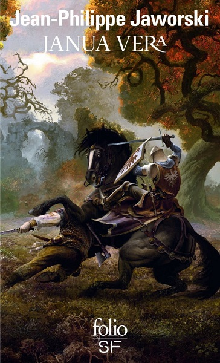
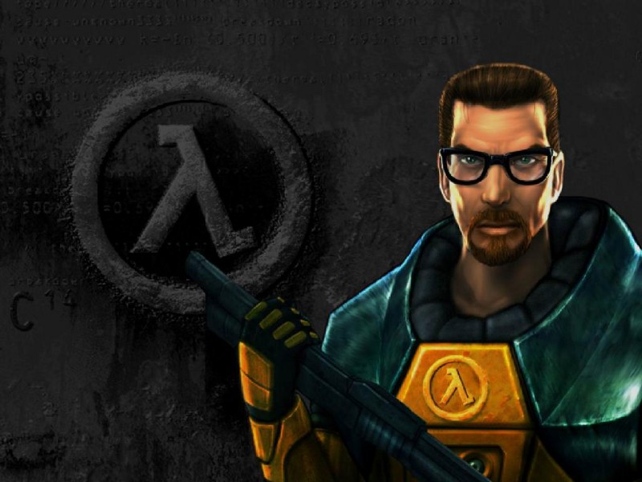

Assez régulièrement, les membres de Coddity vous font découvrir une partie de leur univers en présentant un artiste, un livre, un film, un jeu, un article…

On démarre le volume 1 avec un article technique lié au combat à mort entre les frameworks JS, de la fantasy française, un film NB & couleur, du hip hop jazzy et le père des FPS modernes.

# Littérature
### *Janua Vera, de Jean Philippe Jaworski*, par J.

J’ai lu ce recueil de nouvelles il y a 7 ans et je ne m’en suis jamais totalement remis… Quelle claque… Quel univers…. 

Janua Vera est une expression latine qui signifie “la vraie porte”. Dans la théologie chrétienne, la “vraie porte” désigne le Christ qui est la vraie porte du royaume des cieux. Ici c’est la porte pour entrer dans l’univers du vieux royaume. Un univers de fantasy fascinant et très riche duquel on ne peut jamais vraiment ressortir- d’autant qu’après on a qu’une envie: c’est lire “Gagner la guerre” qui est suite de la nouvelle “Mauvaise donne”. 

A travers 8 nouvelles dans lesquelles JP Jaworski dépeint un univers médiéval et fantastique, on découvre les aventures de Benvenuto, un assassin qui se retrouve dans un complot de la classe politique ciudalienne, les aventures d’Aedan le chevalier qui défend l’honneur de dames etc. Chaque nouvelle est une merveille stylistique et narrative qui nous permet de mieux découvrir l’histoire du vieux royaume, ses légendes, sa mythologie, ses figures et ses folklores . L’écriture de JP Jaworski est ciselée, précise et aérienne. Les détournements, les références médiévales et culturelles sont là pour donner de la consistance au monde fantastique de Janua Vera. 

Au sommaire : Janua Vera ; Mauvaise donne ; Le service des dames ; Une offrande très précieuse ; Le conte de Suzelle ; Jour de guigne ; Un amour dévorant ; Le confident.
Si vous voulez vous évader …Ne ratez pas la porte qui mène au vieux royaume…

# Cinéma 
### *Memento, deuxième film de Christopher Nolan*, par M.

On ne peut discuter de Memento qu’avec des personnes qui l’ont vu. Non par la crainte de spoiler, mais plutôt car c’est un plaisir de voir la lueur de bonheur dans les yeux de son interlocuteur, la sensation de faire partie du même club de privilégiés. Pour être bref, vous aimez les twists? Vous aimez la sensation d’être baladé? Regardez le. Et promis, vous le regarderez une deuxième fois. 

Le pitch est très simple: un homme qui a une amnésie antérograde (!) chasse le meurtrier de sa femme. Le seul hic, c’est que, dès qu’il trouve un indice, il l’oublie dans les instants qui suivent. Sa seul parade: se les tatouer sur le corps et prendre des photos polaroids annotées. Bonne balade (et gaffe aux couleurs)!

Guy Pearce

# Jeu-vidéo
### *Half-life, papa des FPS modernes*

En 98 un petit studio, Valve, sortait Half-life, jeu de tir à la première personne où le joueur incarnait le docteur Gordon Freeman. Mr Freeman est un scientifique d’un centre de recherche secret, Black Mesa, et doit affronter une horde de créatures d’une autre dimension arrivée à la suite d’une expérience ratée. Le Doc a déjà toutes les peines du monde à les affronter mais doit en plus sauver sa vie face aux Marines venus nettoyer toutes les traces de l’expérience. 

Pourquoi ce jeu est culte? Car c’est le premier FPS pour lequel des séquences scénarisées sont scriptées durant la progression du joueur, ce qui promet une immersion efficace, proche de celle qu’offre un film. On se surprend à jouer certaines scènes encore et encore pour en retirer le petit sourire du joueur rassasié (pour ma part l’arrivée des Marines). 

Le succès du jeu a été prolongé par les mods des très célèbres Counter-Strike, Team Fortress et Day of Defeat qui ont occupé les nuits de beaucoup de joueurs, puis un deuxième opus, très envoûtant sorti en 2004.

"Le Freeman"

# Musique
### *Tehu et son EP boulevard*, par JB.

Premier EP de ce beatmaker québécois membre du collectif “tour de manège”, il allie sonorités jazzy et beat groovy joués sur MPC. Ce que j’aime sur ce projet, c’est qu’il est pensé pour le live, il suffit de voir ses vidéos pour s’en rendre compte. Cet EP instrumental laisse une grande place à l’improvisation et ne demande qu’à être enrichi par d’autres instruments.

<iframe style="border: 0; width: 350px; height: 350px;" src="https://bandcamp.com/EmbeddedPlayer/album=1956493563/size=large/bgcol=ffffff/linkcol=0687f5/minimal=true/transparent=true/" seamless><a href="http://tehu.bandcamp.com/album/ep-boulevard-vinyl-edition">EP Boulevard - Vinyl Edition by Tehu</a></iframe>

# La TeK
### *Article "AngularJS vc Backbone.js vs Ember.js" de Uri Shaked*

La galaxie JS est incontournable en ce moment mais les frameworks JS sont nombreux et évoluent rapidement. Les choix en termes de technos peuvent avoir un impact important sur la réalisation du projet. Dans l’article “AngularJS vc Backbone.js vs Ember.js” de Uri Shaked qui travaille pour Watchdox et organise le groupe de développeurs Google de Tel Aviv, on découvre les forces et faiblesses de ces 3 frameworks. Uri fait une comparaison poussée de ces 3 technos et nous apprend à y voir plus clair sur les similarités et différences d’Angular, Backbone et Ember. Indispensable.

[https://www.airpair.com/js/javascript-framework-comparison](https://www.airpair.com/js/javascript-framework-comparison)
