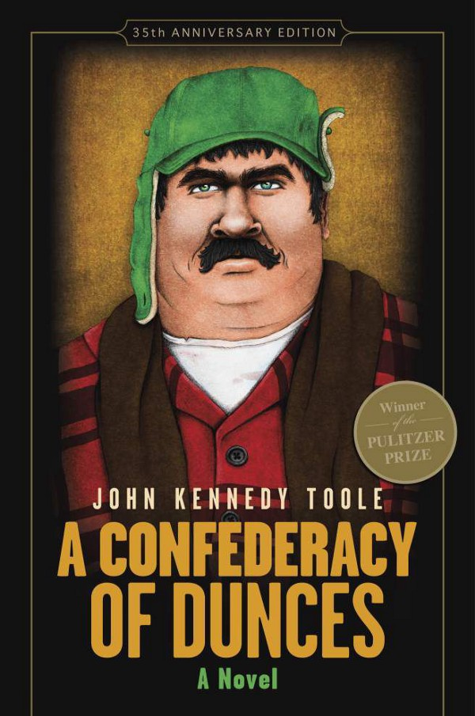
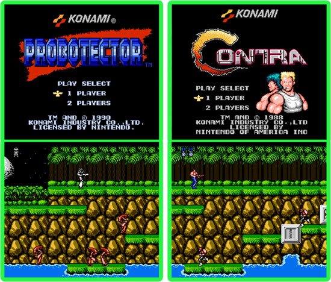

Assez régulièrement, les membres de Coddity vous font découvrir une partie de leur univers en présentant un artiste, un livre, un film, un jeu, un article…

Pour ce volume 2, nous vous avons sélectionné une excellente roadmap de langages Web, une série enneigée, un livre qui a tué son auteur, l’un des jeux les plus durs de tous les temps et un petit son des familles.

# LaTeK

[https://medium.freecodecamp.com/a-roadmap-to-becoming-a-web-developer-in-2017-b6ac3dddd0cf](https://medium.freecodecamp.com/a-roadmap-to-becoming-a-web-developer-in-2017-b6ac3dddd0cf)

Dans cet article on retrouve 3 roadmaps pour devenir développeur frontend, backend et devops. Les roadmaps ont été créées par un utilisateur GitHub : Kamranahmedse (lien github). Chaque case représente une techno qui est une recommandation de l’auteur, une possibilité ou un choix à faire. Ces roadmaps décrivent l’évolution possible d’un développeur et proposent une vision schématique claire de l’organisation hiérarchique des technologies. Si ces maps n’ont pas vocation à être exhaustives, elles permettent de se figurer facilement des interactions entre les technologies et l’exploration possible de celles-ci. C’est simple et précis. Un article très intéressant.

# Série
### *Fargo*, une série FX par J.

*Après l’excellent film des frères Cohen, j’avais peu d’attentes pour l’adaptation télévisuelle, mais quelle claque! La saison 1 est un chef-d’oeuvre du genre. Tout simplement.*

*On se retrouve littéralement happé par les paysages enneigés, par l’ambiance sombre et loufoque, par l’univers ultra-violent. On retrouve tout à fait l’univers des frères Cohen à la fois oppressant et fascinant. Si les effusions de sang se font plutôt rares, la psychologie des personnages est au premier plan, ce qui leur donne une réelle profondeur.*

*Pour le pitch, l’histoire se déroule en 2006 dans le Minnesota, Lorne Malvo un tueur à gages verse le sang sur son passage et sa rencontre avec Lester va bouleverser la vie de ce dernier. L’adjointe Molly Solverson mène son enquête pour démêler l’imbroglio criminel qui touche la petite ville du Minnesota. C’est une enquête passionnante et surprenante, d’autant plus que c’est adapté de fait réels. Magnifiquement interprétée, filmée et scénarisée, cette saison 1 de Fargo est une pépite. Une saison tout simplement glaçante.*

# Littérature
### *La conjugaison des imbéciles, de John Kennedy Toole*

OVNI littéraire !

Dans la Nouvelle Orléans des années 60, La conjuration nous raconte la vie d’Ignatius Reilly, étudiant en littérature médiévale, paranoïaque et hypocondriaque. Ignatius et son intelligence sont en conflit avec le monde et leur époque à la manière d’un Don Quichotte rencontrant tous les archétypes de la société américaine des 60’s. Le livre, pour peu que l’on se glisse dans le psyché d’Ignatius, est drôle, extrêmement drôle, malgré quelques longueurs. Les situations absurdes qui opposent cet érudit à son monde, s’enchaînent et dévoilent une galerie de personnages hauts en couleurs: sa mère, sa comparse Myrna et même Nola (Nouvelle Orléans pour les intimes) véritable personnage à part entière du récit.

L’histoire du roman en lui-même est déjà remarquable: l’auteur, ayant écumé toutes les maisons d’éditions avec son manuscrit, s’est suicidé se pensant écrivain raté. C’est grâce à la persévérance de sa mère que le livre fut publié 11 ans après sa mort et remporta, excusez du peu, le prix Pulitzer de la fiction.

Si vous aimez les personnages des films des frères Cohen, foncez, vous ne serez pas déçu!

# Jeux vidéo
### *Contra / Probector, 1988*

Incarnant un humain (Contrat) ou un robot (Probotector) selon la plateforme, ce jeu est un Run&Gun 2D qui a donné des réflexes surhumains à tous joueurs l’ayant approché: 3 vies et c’est tout. Une touche d’un ennemi et c’est fini. Evidemment, les acharnés ont fini par le connaitre par coeur pour le terminer. Les moins fous ont usé du Konami code (le fameux haut haut bas bas gauche droite gauche droite B A start) pour obtenir un package de vies salutaire. En tout cas, l’un des jeux les plus difficiles ayant été fait. Pour les jeunes et qui voudraient savoir ce que veut dire “niveau de difficulté” celui-ci est disponible sur pas mal de plateformes modernes (xbox) ou émulateurs.

# Musique
### Conor Oberst de Conor Oberst par J.

*Album solo de Conor Oberst, auteur compositeur américain de folk rock américain connu notamment pour son implication dans l’excellent groupe Bright eyes. Un album que j’ai écouté en boucle et qui est idéal pour un road trip. Des routes ouvertes à perte de vue, un son chaleureux, entraînant, lyrique… Cape Canaveral est pour moi, la meilleure musique de l’album. C’est une véritable découverte. Bref, si vous voulez voyager, c’est l’album idéal…*

<iframe width="560" height="315" src="https://www.youtube.com/embed/Ol7UeGiv7n8" frameborder="0" allow="accelerometer; autoplay; encrypted-media; gyroscope; picture-in-picture" allowfullscreen></iframe>

