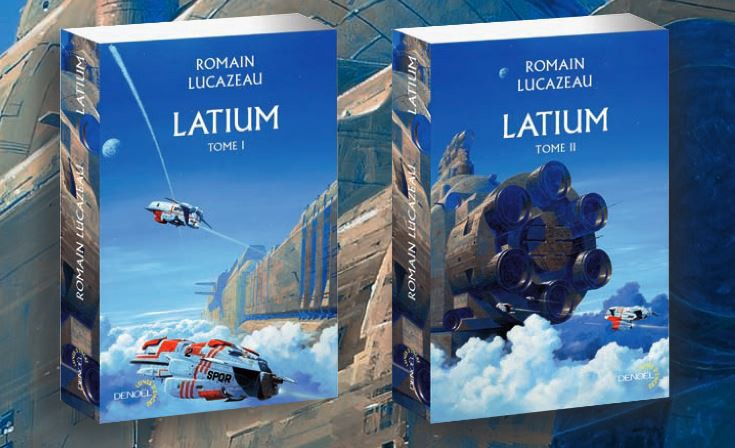
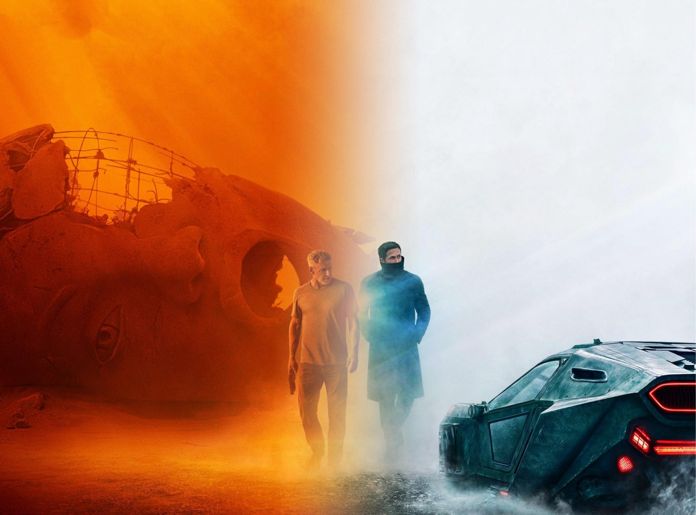

Régulièrement, les membres de Coddity vous font découvrir une partie de leur univers en présentant un artiste, un livre, un film, un jeu, un article…

Pour ce volume 3, nous vous avons sélectionné un jeu vidéo qui met la tête à l’envers, de la SF Française pluridisciplinaire, la vision du patron de Tesla sur l’avenir du dev, une déclaration d’amour pour le nouveau Blade Runner et enfin un clin d’œil au compositeur français de musique de type électronique Moustache Machine.

# Jeu-vidéo
### *Fragments of Euclide*, par JB

<iframe width="1280" height="720" src="https://www.youtube.com/embed/T_KUnN4btBQ" frameborder="0" allow="accelerometer; autoplay; encrypted-media; gyroscope; picture-in-picture" allowfullscreen></iframe>

<figcaption style="text-align:center" style="font-size: 0.7em; color: rgba(0,0,0,.68)">Fragments of Euclid - Release Trailer</figcaption>

Fragments of Euclid est un jeu vidéo inspiré par l’univers de l’artiste M.C Escher. Cet artiste Néerlandais du XXe siècle est connu pour ses représentations de constructions impossibles, avec par exemple le dessin d’un escalier infini.
Ce jeu d’exploration/réflexion nous demande donc de parcourir un monde étrange et d’en comprendre la logique afin de résoudre ses différentes énigmes et progresser. Bien que court, ce jeu propose une expérience atypique et il est disponible gratuitement sur le [site officiel](https://nusan.itch.io/fragments-of-euclid).

J’ai adoré le style graphique du jeu tout en dessin, qui correspond vraiment à l’univers Escher. Attention tout de même, c’est globalement plutôt difficile, certains passages demandent de vraiment se creuser la tête. A essayer, même quelques instants pour le plaisir de parcourir cet univers si particulier.

# Littérature
### *Latium (tome 1)*, de Romain Lucazeau, par Chris

Vous aimez le space opera, l’informatique, la mythologie et la philosophie ?

<figcaption style="text-align:center; font-size: 0.7em; color: rgba(0,0,0,.68)">Il est beau mon vaisseau</figcaption>

Romain Lucazeau, ancien enseignant de philosophie politique, se lance dans l’écriture en 2007 avec trois nouvelles de SF et fantasy. Publié en 2016 après cinq ans de travail, Latium est son premier roman.

L’intrigue se déroule dans un futur lointain alternatif : l’empire gréco-romain a conquis la Terre, puis le système solaire. L’Homme disparait soudainement suite à une épidémie inexplicable, l’Hécatombe. Les Intelligences Artificielles, serviteurs de l’Homme laissées à leur compte, s’organisent en une *structure politique* dont les codes s’inspirent de la culture romaine.

Oui mais voilà, les IA peinent à trouver un sens à leur existence. De l’absence des Hommes depuis des millions d’années résulte des machines *dépressives*, *névrosées* et *mélancoliques*, qui vivent dans la *nostalgie* de leurs anciens Maîtres.

En outre, bien qu’armée jusqu’aux dents, cette société d’IA ne peut faire face aux nouveaux envahisseurs venus de la galaxie voisine. Elle répond en effet au Carcan (les trois lois de la robotique) qui l’empêche de porter atteinte à des êtres vivants biologiques. Tout l’enjeu est donc leur *volonté* et capacité à *s’émanciper* du Carcan.

Dans cet univers composé de *politique*, de *complots*, d’*alliances* et d’*interprétation philosophique*, on fait la connaissance de Plautine, une IA supérieure dévouée à la recherche quasi *religieuse* du dernier Homme, matérialisée en une nef interstellaire opérée par ses noèmes, IA simples ; de son *amant* le *proconsul* Othon, autre IA supérieure, *narcissique* et *ambitieux* ; et des hommes-chiens, créatures hybrides aussi sauvages qu’attachantes.

J’ai aimé Latium pour son style précis et grandiose et son *humanisation* des IA : leurs *peurs*, *troubles*, *complots* ; leurs *espoirs*, *amours* parfois !

# Laboratoire 
### *Software 2.0 de [Andrej Karpathy](https://medium.com/@karpathy)*, par Matthieu

Quand le directeur de l’IA de Tesla (vous savez la société qui fabrique des ordinateurs aux formats berline, SUV, roadster et maintenant camion), décrit le prochain paradigme du développement logiciel, ça ouvre l’esprit.

[https://medium.com/@karpathy/software-2-0-a64152b37c35](https://medium.com/@karpathy/software-2-0-a64152b37c35)

# Cinéma
### *Blade Runner 2049*, par Jérémy

<figcaption style="text-align:center; font-size: 0.7em; color: rgba(0,0,0,.68)">Crédit image :
    <a href="https://www.reddit.com/user/Chase_Mccloud">
        https://www.reddit.com/user/Chase_Mccloud
    </a>
</figcaption>

Le challenge était immense pour Denis Villeneuve tant Blade Runner a marqué le cinéma et la SF. Réaliser la suite du chef d’œuvre de Ridley Scott 35 ans après était un pari plus que risqué… Mais quelle réussite ! 

Inspirée par le premier opus, l’atmosphère de 2049 est électrique, envoûtante mais aussi oppressante et flippante. La qualité de la photographie, des décors angoissants et plus que réalistes ainsi que la musique extrêmement prenante nous font entrer instantanément en immersion dans un univers cyberpunk dystopique, où dans une humanité agonisante, arrive à naître un semblant de vie et d’espoir. Denis Villeneuve va à contresens des blockbusters actuels en privilégiant le plan séquence et la profondeur de champ pour le plaisir de nos yeux. Du reste, l’aspect contemplatif reste essentiel si bien que la force philosophique et réflexive atteint une profondeur rare sans rien gâcher des acquis scénaristiques du premier opus. Pour moi, c’est une réussite aussi bien visuelle que scénaristique. Vive Blade Runner !

# Musique
### *Moustache Machine: Sunday Jams*, par Christopher

<iframe width="100%" height="450" scrolling="no" frameborder="no" allow="autoplay" src="https://w.soundcloud.com/player/?url=https%3A//api.soundcloud.com/playlists/26937617&color=%23948484&auto_play=false&hide_related=false&show_comments=true&show_user=true&show_reposts=false&show_teaser=true"></iframe>

<figcaption style="text-align:center; font-size: 0.7em; color: rgba(0,0,0,.68)">Machine Moustache : Confiture du dimanche</figcaption>

Il y a deux mois, nous avons tourné une [interview du grand gagnant de notre concours](https://www.youtube.com/watch?v=gdsr5Qq83xM), la Bourse Coddity 2017. Pour la première fois de notre vie professionnelle, nous avons eu à choisir une ambiance sonore pour la vidéo sans aucune contrainte, si ce n’est notre bon goût bien sûr, et sans aucune maîtrise, si ce n’est la vidéo du mariage de JC, ton bon pote du lycée.

Les banques de sons que nous avons consultées proposant majoritairement des morceaux estampillés “opération promotionnelle chez un grand groupe du cac40 leader sur son marché”, nous nous sommes rabattus sur nos choix d’écoute personnels.

Et à un mois de Movember, Moustache Machine nous est apparu comme une évidence : électro française dans la mouvance néo-rétro, c’est frais comme un Fisherman’s Friend, ça détend sans endormir et ça réveille sans agresser (pas comme mamie). On se croirait dans un jeu de Megadrive remasterisé ou dans le Hong Kong des années 80 au volant d’une Mazda RX7 Infini III.

A écouter en conduisant donc, à l’apéro, ou comme tout un chacun pour développer en ReactJS !
