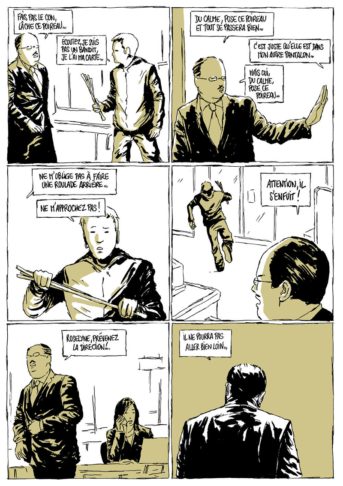
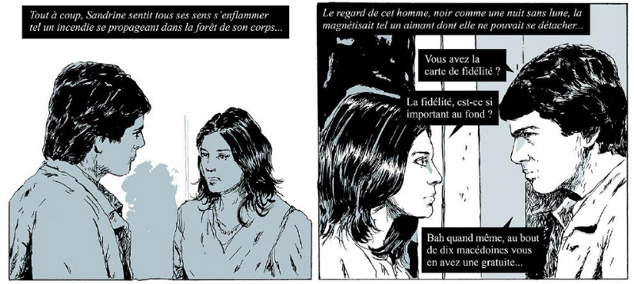
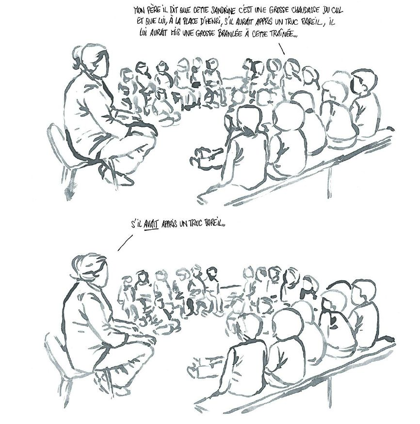
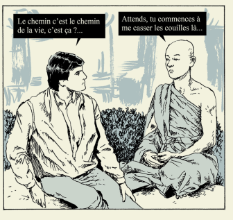
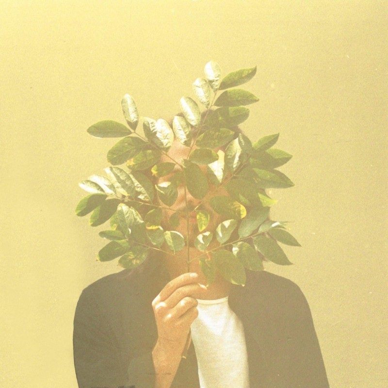

Régulièrement, les membres de Coddity vous font découvrir une partie de leur univers en présentant un artiste, un livre, un film, un jeu, un article…

Pour ce volume 4, nous vous proposons un court-métrage d’animation, un aperçu de la nouvelle œuvre décalée et à l’humour absurde de Fabcaro, et un coup d’œil sur le nouvel album de FKJ.

# Court-Métrage
### *FARD*, par Chris

*FARD* est un court-métrage de Luis Briceno et David Alapont sorti en 2009. Il prend place dans une société futuriste qui semble très normalisée et en paix.

On suit l’histoire d’Oscar, qui se fait livrer un paquet à son bureau par un collègue. Oscar ne peut s’empêcher de l’ouvrir et y découvre un objet qui va lui ouvrir les yeux sur le monde.

Je ne peux malheureusement vous en dire plus sans vous spoiler.

<iframe src="https://player.vimeo.com/video/68223831" width="640" height="360" frameborder="0" allowfullscreen></iframe>

J’ai apprécié FARD tout d’abord car je ne m’attendais pas à cette évolution de scénario. Ensuite, j’ai aimé son style graphique et son ambiance, qui sont bien entendu au service de l’intrigue.

1) Initialement, la société est homogène et paisible : style épuré et moderne qui rassure, architecture minimaliste, verticale, plans larges, ambiance sonore douce, particulièrement les voix ;

2) Puis, on ressent l’angoisse d’Oscar : plans serrés, voix et sons plus durs, disparition de la musique, respirations fortes.

Sur le même thème, je vous conseille le film *Equilibrium* ou le livre *This perfect day* d’Ira Levin. Et bien sûr, la série Black Mirror.

# BD
### *Et si l'amour c'était aimer ?* de Fabraco, par Ali

Il faut dire qu’avec *Zaï zaï zaï zaï* en 2015, l’histoire d’un type pourchassé dans tout le territoire pour avoir oublié la carte de fidélité d’une grande surface dans un autre pantalon, l’auteur nous avait déjà offert de franches poilades à travers un enchaînement de situations absurdes devenues depuis pour la plupart cultes !

Après le gros succès de ce *roadmovie* absurde et brillant auprès des critiques et du public, que pouvait donc bien nous réserver son drôlissime auteur ?

Le pitch de sa nouvelle œuvre est simple : Sandrine est mariée à Henry, riche startupper, et vit avec lui une “suite de surprises renouvelées chaque jour”. Jusqu’à sa rencontre avec Michel, livreur chez Speed Macédoine et beau chanteur ténébreux d’un groupe de pop-rock. De ses successives commandes de repas naîtra une idylle secrète, qui va bouleverser sa vie. Cet amour soudain survivra-t-il aux multiples obstacles qui se dresseront devant eux ?

Vous l’aurez compris, cette fois c’est aux grandes histoires d’amour qu’il s’attaque, avec une BD reprenant pour style celui des romans graphiques et autres télénovelas si chers à toute une précédente génération !

Maniant le *nonsense* avec panache, Fabcaro s’amuse à nous présenter une galerie de personnages secondaires d’une vacuité désopilante, dotées de logiques biaisées mais implacables, que l’on découvre aux gré de multiples saynètes venant régulièrement interrompre le cours du récit. Comme dans *Zaï zaï zaï zaï*, ces strips participent à créer un rythme vif, nous balançant répliques et situations absurdes dans un flot continu !

Au final si ce Et si l’amour c’était aimer ? nous a moins surpris qu’on aurait souhaité, peut-être parce qu’il adresse un genre déjà très souvent parodié. Nous avons tout de même passé un excellent moment à le lire, agrémenté de plusieurs francs éclats de rire : contrat rempli ! Et maintenant une seule question se pose : à quand le prochain ??

Et si l’amour c’était aimer ?, de Fabcaro chez 6 pieds sous terre.

[Premières planches en lectures libres sur le site de l’éditeur.](http://6pieds-sous-terre.com/collection-monotreme/fabcaro-et-si-l-amour-c-etait-aimer/-u2699)

# Musique
### *French Kiwi Juice* de FKJ, par Mathilde.

Si vous aimez la soul, le jazz ou encore la funk, cet album pourrait vous plaire !

Mêlant trompette, synthé et quelques sample bien trempés, FKJ nous transporte dans un univers à la fois funk, jazz et emprunt de quelques notes groovy. Derrière des influences outre-atlantiques bien présentes, on parvient tout de même à reconnaitre la french touch caractéristique de nos artistes électros.

Si certains de ses sons font bouger nos corps, d’autres plus mélancoliques vous invitent à partager un voyage musical intéressant. Les featuring nombreux qui complètent sa musicothèque montrent son talent à varier les styles : ici Hip-hop, là plus expérimental. Alors s’il apparait difficile de s’animer sur ses musiques, on peut toutefois aisément se laisser porter par l’ambiance chill et confortable de ce Hip-hop instrumental.

En bref, selon moi, l’album de FKJ se prête parfaitement à une écoute posée entre amis autour d’un petit apéro.

<iframe width="100%" height="450" scrolling="no" frameborder="no" allow="autoplay" src="https://w.soundcloud.com/player/?url=https%3A//api.soundcloud.com/playlists/305445946&color=%23948484&auto_play=false&hide_related=false&show_comments=true&show_user=true&show_reposts=false&show_teaser=true"></iframe>

