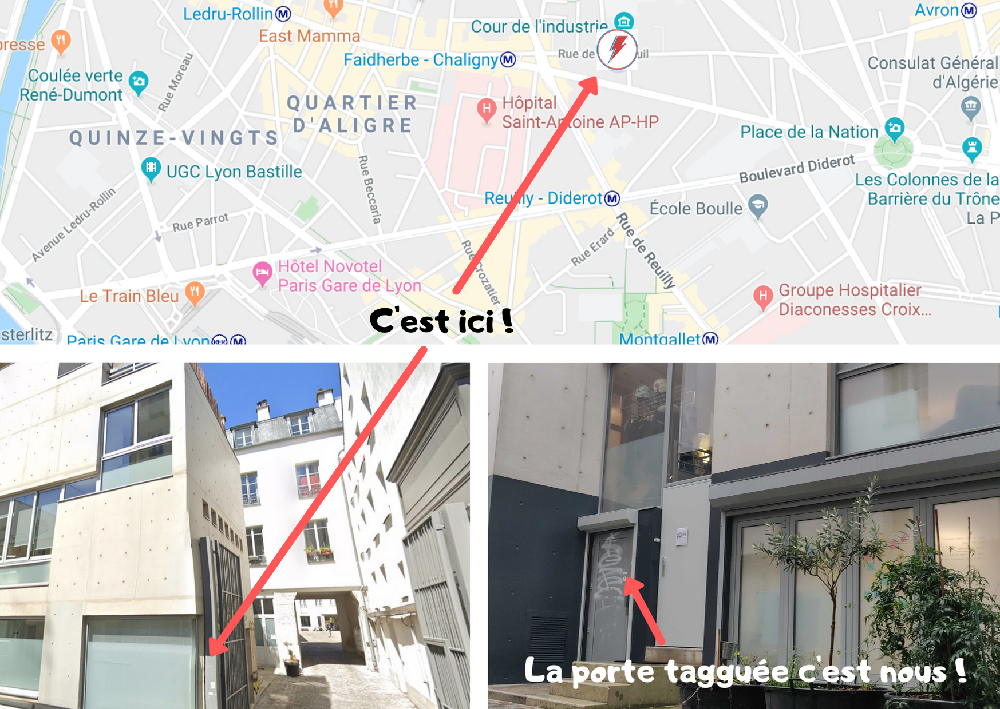
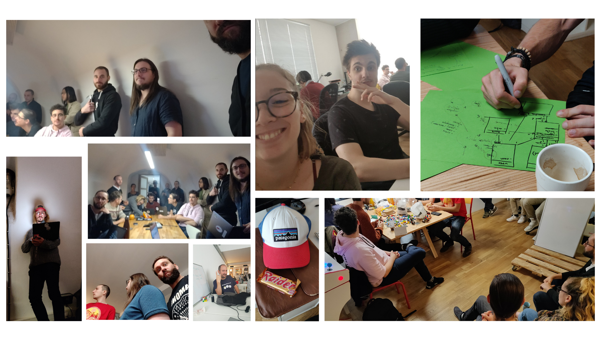
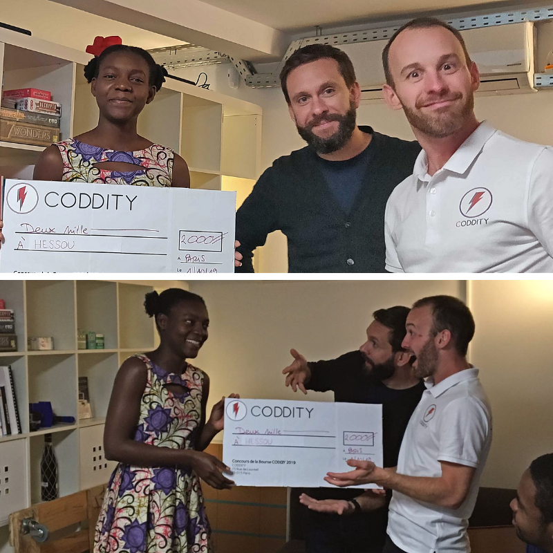
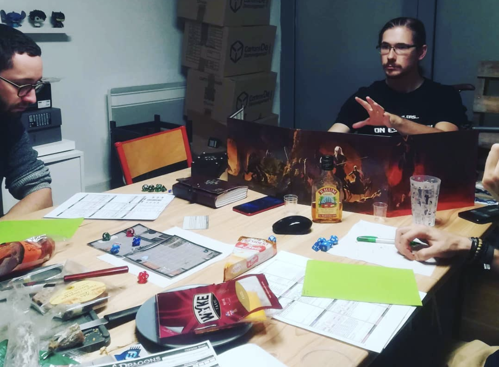
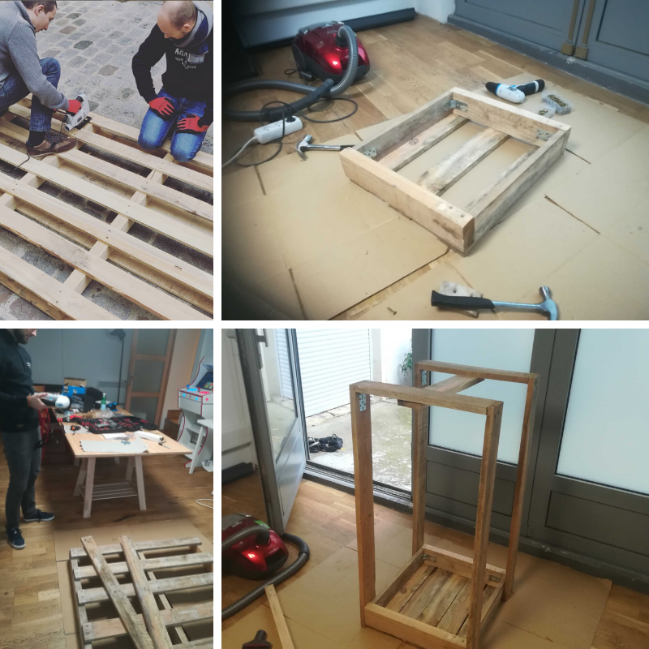

###On adore le mois d'octobre chez Coddity !

L'arrivée du froid, les feuilles qui tombent, les factures du 3ème trimestre à payer, et tant d'autres petits plaisirs coupables !

Il s'est passé pas mal de chose durant ce mois d'octobre alors voici un petit récap !

###Déménagement !

Nous avons posé nos valises au 37bis rue de Montreuil dans le 11ème, en colocation avec les amis de chez [Pikel](http://pikel.fr).
Nous sommes juste à l'entrée de la cour de l'industrie, hébergeant de nombreux artisans d'art. Un de ces coins cachés dont Paris regorge !

Passez nous voir, on s'est enfin débarrassé de tous les cartons, tout le monde a un bureau, le fablab est déployé, et on a toujours ce qu'il faut au frais pour accueillir du monde !

###Atelier Hackathon sur 2 jours

D'habitude, nous réalisons les Ateliers sur une journée, un vendredi par mois.
Cette fois-ci nous avons décidé d'inaugurer une nouvelle formule, un Hackathon interne sur 2 jours sur un thème très large, la *transmission*, pour pousser l'équipe à la créativité.

Il en est sorti 4 projets:
- une extension firefox pour lutter contre les fakenews
- une app de testament numérique
- une app de remontée d'alerte sur les abus écologiques
- une app de soutien à l'économie circulaire de mobilier d'entreprise

C'était bien.

Du coup, on va le refaire une fois par semestre 😎

 

###Remise de la bourse Coddity 2019

Comme chaque année, nous encourageons un.e jeun.e étudiant.e dans ses études en lui remettant une bourse d'une valeur de 3500€.
Bravo à [Hessou](https://www.linkedin.com/in/hessou-panassim/) et [Xavier](https://www.linkedin.com/in/xavier-tremillon-503563178/) pour l'édition de cette année !
Plus d'info sur le [site dédié](https://bourse.coddity.com).

 

###JDR

Première édition de notre Dungeons & Dragons mensuel ! Nos aventuriers ont démarré enfermés dans la prison d'une galère, ont déclenché une mutinerie et se sont échappés sur une barque en taillant leur chemin au tranchant de leur épée batarde, à l'aide de coups critiques ratés et de lancers de CA plus que limites.
Merci à Vincent, notre MJ, pour l'aventure du soir et la campagne qui s'annonce 🧙‍

 

###Fablab - Serre autonome

Premier projet de notre Fablab interne, la serre autonome avance !

L'électronique est prête et opérationnelle depuis quelques semaines, et le prototype de structure a été réalisé ce mois-ci, en utilisant un maximum de produits déjà utilisés pour minimiser l'empreinte carbone.
Un article complet détaillant le projet est en cours de préparation.

 

C'est tout pour ce mois-ci !

Si vous souhaitez suivre la vie de Coddity de l'intérieur, c'est sur [Instagram](https://www.instagram.com/instantscoddity/) que ça se passe. Pour les infos sérieuses (ça nous arrive une fois de temps en temps), la page [LinkedIn](https://www.linkedin.com/company/coddity/) est faite pour ça !