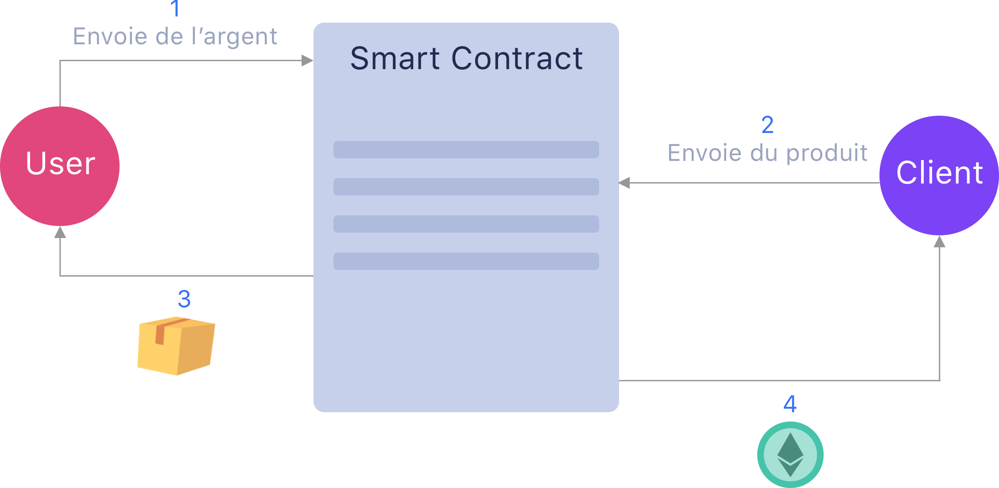
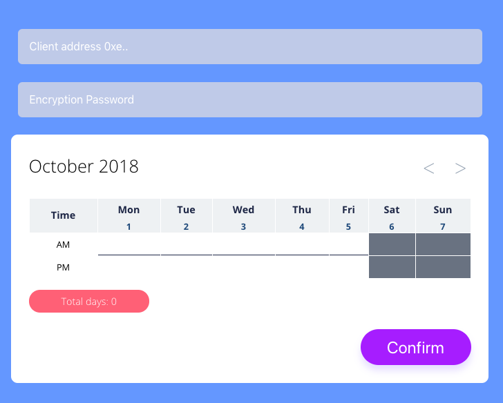

Chez Coddity on aime bien expérimenter en condition réelle et voir ce qu’il y a derrière les #hashtags. 
Pour l’article du jour, nous avons jeté notre dévolu sur la blockchain avec la mise en place d’un prototype de Smart Contract. 
Avant de rentrer dans le vif du sujet, quelques rappels pour ceux qui n’auraient pas suivi; la littérature étant "très" abondante sur le sujet, nous allons être bref. 

# Une application avec une chaîne et des blocs ?

**Blockchain** est un **registre distribué inaltérable** qui stocke des transactions entre personnes ou entités. Ce registre peut stocker des soldes de comptes, la propriété d'actifs et tout type de données liées qui doivent être liées à une personne physique ou une entité.
Étant donné qu'il est **distribué**, aucune autorité centrale ne peut être sujette à des erreurs ou à des fraudes : tous les membres du réseau partagent les mêmes informations. 
C'est **inaltérable** car une fois que l'information est validée dans le registre, elle ne peut pas être modifiée. Cela se traduit par un système d'échanges fiables et non-censurables par rapport aux méthodes traditionnelles.
Les applications qui s'appuient sur cette technologies, les Dapps, connectent directement utilisateurs et fournisseurs de service, d'une façon totalement décentralisée.

##Web 3.0

Ni Internet ni le Web n'ont été conçus à l'origine pour être des systèmes sans confiance. Des composants ont été régulièrement introduits pour améliorer la sécurité, tels que le protocole TLS (Transport Layer Security), les autorités de certification et les extensions [DNSSEC](https://en.wikipedia.org/wiki/Domain_Name_System_Security_Extensions) (Domain Name System Security Extensions). Malheureusement, beaucoup de ces améliorations ne sont que partiellement adoptées.
[Gavin Wood](http://gavwood.com/)(le cofondateur et CTO de Ethereum) a popularisé le terme Web 3.0 pour des alternatives sans confiance basées sur la blockchain au Web. Le Web 3.0 fait aussi parfois référence au Web sémantique. Enfin, il fait également référence à un ensemble standard d'interfaces de programmation d’applications en Ethereum.

##Pseudonyme

Autre avantage, les utilisateurs du Web 3.0 sont des pseudonymes. Ils ne sont identifiés que par leurs comptes, contrairement au Web, où les adresses peuvent être associées à des identités.

##Ethereum

Ethereum est un protocole open-source d'échanges décentralisés permettant la création par les utilisateurs de contrats intelligents grâce à un langage [Turing-complet](https://fr.wikipedia.org/wiki/Turing-complet). Ces contrats intelligents sont basés sur un protocole informatique permettant de vérifier ou de mettre en application un contrat mutuel, ils sont déployés et consultables publiquement dans la blockchain. Ethereum a été créé par [Vitalik Buterin](https://fr.wikipedia.org/wiki/Vitalik_Buterin), un jeune développeur d'origine russe, passionné par les mathématiques, qui s'est penché très jeune sur le Bitcoin.    

##Smart Contract

Un smart contract est un contrat qui s'appuie sur une technologie blockchain pour établir une transaction entre un fournisseur et un client, de façon transparente, inaltérable et vérifiable. 



- Quand User transfère la somme d’argent demandée pour le prix total du produit A, alors le produit A est à User.
- Quand Client envoie le produit A, alors la somme (d’argent) est envoyée à Client.
- Quand la validation est terminée, alors la somme est à Client.


# Prototype CRA sur blockchain

Pour tester les avantages et les limites d’une telle solution par rapport à une base de données standard, nous nous sommes lancés sur un prototype de Smart Contract avec Ethereum.

Nous avons choisi le sujet que tout professionnel de l’IT  a un jour rencontré dans sa vie: le **CRA a.k.a. “Compte Rendu d’Activité”**.

Le principe du **CRA**: un Fournisseur établi une **feuille de temps** à chaque fin de mois, celle-ci est soumise à son Client pour validation et signature, et finalement c’est cette signature qui fait foi lors de la facturation de la prestation réalisée par le Fournisseur.
Généralement, les CRA sont au mieux établis via des applications web, au pire des feuilles Excel. Mais dans la grande majorité des CRA, imprimés, signés à la main et ensuite scannés. 

Pour simplifier notre prototype nous sommes parti sur les principes suivants:
le Fournisseur intervient sur 1 seul projet pour 1 seul Client
la granularité de travail est la demi journée 

Les utilisateurs ont accès à une **webapp** qui permet la saisie des temps, la soumission de la feuille, et la signature par le client.

##Environnement technique.

La création des Smart Contracts est faite avec un langage orienté contrat : **Solidity** pour Ethereum. Le langage dispose d’une [documentation officielle très complète](https://solidity.readthedocs.io/en/v0.4.25/)
Solidity est supporté par les IDE les plus courants du marché (VS code, Atom,...) et de nombreux pluggins existent.

[Truffle](https://truffleframework.com/) et [Embark](https://embark.status.im/) sont 2 outils nécessaires pour virtualiser la blockchain sur une machine en local. 

**Point important**: un smart contract ne peut pas être mis à jour après son déploiement sur le réseau principal Ethereum (main net), la conception et les tests du contrat doivent alors représenter une part importante dans le temps de conception.  
  
##Conception

Notre prototype s’inscrit dans la relation client - fournisseur de prestation et vise à créer un système de signature indépendant entre les deux utilisateurs Client et Fournisseur. 

Le proto de la webapp est réalisée en **React/Redux** et permet:
- la saisie des temps par semaine par le Fournisseur
- la soumission des informations par le Fournisseur
- l’affichage des informations par le Client
- La signature par le client



Le sujet portant majoritairement sur la mise en place du système de signature de CRA, nous n'allons pas trop développer la description de la Webapp.   

Passons à la conception du contrat!

Chaque utilisateur possède 2 adresses, une publique et une privée:
- **clef publique** : c’est l’identifiant de l’utilisateur, connue par toute la blockchain. l’adresse est une chaîne de 40 caractères hexa
- **clef privée** : connue uniquement par l’utilisateur, elle est composée d’une chaîne de 64 caractères hexa  

Un exemple d’adresse publique parmis tant d’autre `0x4c68E5BD7C49F99283Bc4548D514bedB9ae71f9f`, c’est celle de Coddity, alors si vous souhaitez faire un don… Vous pouvez y aller!

##Solidity

**Solidity** est un langage de **typage statique** (comme Swift, Kotlin, Scala) orienté pour le développement des Smart Contract qui fonctionne  sous EVM (Ethereum Virtual Machine). Solidity est compilé en un bytecode qui est executable sur EVM.
Spécifié par Gavin Wood (toujours le même), ce langage est conçu autour de la syntaxe ECMAScript pour le rendre familier aux développeurs Web, mais contrairement à ECMAScript, il comporte des types de saisie statique.

##Notre Smart Contract CRA

```
pragma solidity ^0.4.23;
contract ActivityReport {
	address public owner;
	uint public counter = 0;
	constructor() public {
		owner = msg.sender;
	}
}
```
La déclaration `pragma solidity ^0.4.25` indique la version de compilateur utilisé. Un contrat Solidity doit commencer par cette déclaration, chacune des versions ayant ses spécificités.

Le Smart Contract est un type `contract` comme dans notre exemple `ActivtyReport`.

Un type `contract` est similaire à une classe d’un langage orienté objet et contient des déclarations de variables d’état, des fonctions, des events, des structures.


Les variables du contrat peuvent être déclarées en `public` et, comme le nom l’indique, les rendra publiques et accessibles à tous une fois le contrat déployé.

Les variables sont ensuite initialisées dans un `constructor`, qui sera initialisé au déploiement du contrat, **une seule fois et à vie**.

Dans notre exemple nous avons besoin d’un compteur `counter` de chaque contrat créé et de déterminer le `owner`, le créateur du smart contract.

On initialise le créateur/owner du smart contract dans une fonction constructor avec msg.sender qui retourne l’adresse de la personne qui envoie la transaction actuelle, qui dans notre cas est le déployeur du contrat

Le contrat est maintenant initialisé, passons au CRA qui s’appuie sur celui-ci.
```
struct ActivityReportContract {
	address sender;
	address client;
	bool reportSigned;
}
mapping (uint => ActivityReportContract ) activityStruct;
```
Solidity permet la création de types personnalisés avec `struct`. Le CRA de notre projet est un type `struct` qui contient 2 adresses: 1 pour `sender` (Fournisseur) et 1 pour `client` le Client (what a surprise). Le statut de la signature sera établi par un booléen `reportSigned`.

Pour stocker les données des contrats, Solidity utilise un type `mapping`. Celui-ci peut être vu comme une table de hashage mais avec des clefs qui ne sont pas réellement stockées dans le mapping. Seul le hash `keccak256` d’une clef est utilisé pour rechercher une valeur (pour creuser sur [keccak]( https://en.wikipedia.org/wiki/SHA-3)).
La documentation de Solidity est assez précise sur les type [mapping](https://solidity.readthedocs.io/en/v0.4.24/types.html#mappings).

  ```
function createActivityReport(address client)  external  {
	counter++;
	activityStruct[counter]  = ActivityReportContract(msg.sender, client,  false);
}

  
function signActivityReport(uint reportId)  external  {
	require(msg.sender == activityStruct[reportId].client);
	activityStruct[reportId].reportSigned =  true;
```
La création du CRA passe par l’utilisation d’une fonction `CreateReport` spécifiée comme `external`. Une fonction spécifiée de cette façon s’apparente à une interface externe du contrat, qui peut donc être appelée par d’autres contrats via des transactions.

`CreateReport` va utiliser 2 variables, l’adresse du Client (passée en paramètre) et le celle du fournisseur (reçue par `msg.sender`).

On incrémente ensuite le compteur `counter` pour avoir un nouveau id du contrat, puis on stocke les données du type `ActivityReportStruct` dans notre table `activityStruct`.

Enfin l’acte de signature passe par une fonction `signActivityReport`.

Celle-ci vérifie que l’executeur de la transaction correspond bien au Client du contrat avec la condition `require` (avec une levée d’exception dans le cas où celle-ci n’est pas remplie) et ensuite le passage du booléen `reportSigned` à `true` pour acter la signature.
Pour en savoir plus sur les conditions en solidity, c’est par [ici](
https://solidity.readthedocs.io/en/v0.4.24/control-structures.html#error-handling-assert-require-revert-and-exceptions).

Le code très simple de notre CRA:
 ```
 pragma  solidity  ^0.4.23;
contract ActivityReport {
	address  public owner;
	uint  public counter =  0;
	constructor()  public  {
		owner = msg.sender;
	}	
	struct ActivityReportContract {
		address sender;
		address client;
		bool reportSigned;
	}
	mapping  (uint => ActivityReportContract ) activityStruct;
	function createActivityReport(address client)  external  {
		counter++;
		activityStruct[counter]  = ActivityReportContract(msg.sender, client,  false);
	}
	function signActivityReport(uint reportId)  external  {
		require(msg.sender == activityStruct[reportId].client);
		activityStruct[reportId].reportSigned =  true;
	}
}
```

#Quid des données?

Comme vous pouvez le voir, les données stockées avec un smart contract ne sont pas très volumineuses. En effet, il est extrêmement **coûteux** de stocker de la donnée sur la blockchain Ethereum, **on restreint donc au minimum les données à insérer dans les blocs**.

Le cout de stockage d’information sur la blockchain dépend de deux éléments:
 - **taille** des données à insérer dans les blocs
 - **rapidité** d’insertion de la transaction dans les blocs
On restreint donc au minimum les données à insérer dans les blocs

Sur notre projet de CRA, l’un des utilisateurs (le Fournisseur) soumet une feuille de temps pour signature à un autre utilisateur (le Client). Les données d’une feuille de temps sont assez faibles, dans notre cas, un JSON de moins de 250 octets.

Mais que deviendrait le cout de notre Smart Contract si par Client vous avez 1000 signatures à réaliser?

Une des solutions de contournement serait de stocker ces feuilles de temps sur un serveur accessible par le Fournisseur et le Client. Mais quel est l'intérêt dans ce cas d’utiliser un système *décentralisé* de signature pour s’appuyer ensuite sur une donnée *centralisée*?

La solution? [IPFS]( https://ipfs.io/)!

**InterPlanetary File System («IPFS»)** est une solution qui permet de stocker des données sur un réseau décentralisé. Rechercher des fichiers dans IPFS revient à demander au réseau de trouver des nœuds stockant le contenu derrière un **hachage unique**.
On peut ainsi stocker le hash unique généré par IPFS et le stocker dans un  contrat pour lier celui-ci à un contenu.
  
Ce système permet de rester sur **une solution totalement décentralisée**, et une **anonymisation** des données liées aux feuilles de temps (on insère qu’un hash dans les blocs), avec une faiblesse, Client et Fournisseur se partage une clef commune pour crypter/décrypter les données stockées via IPFS.

**Rock 'n roll, notre smart contract est fonctionnel**!

 ##Evolutions

 Le cout de signature de notre CRA est à l'heure actuel de 15 cents par transaction, cout qui peut paraitre élevé à première vue, cependant à mettre en regard du temps perdu par le Client comme le Fournisseur pour signer physiquement une feuille de temps.
 Pour réduire ces coûts, une alternative interessante que nous creusons est la mise en place d'un système de captcha comme [coinhive](https://coinhive.com/) qui permet de monétiser la signature par le Fournisseur comme le Client.

Alors résumons, nous voici avec un système de signature décentralisé de documents, eux même décentralisés et sécurisés. Celui-ci est en l'état utilisable pour de nombreuses applications, de la mise à disposition de fiche de paie à de la signature d'actes notariés. 

Nous vous tiendrons au courant des suites apportées au projet! 
