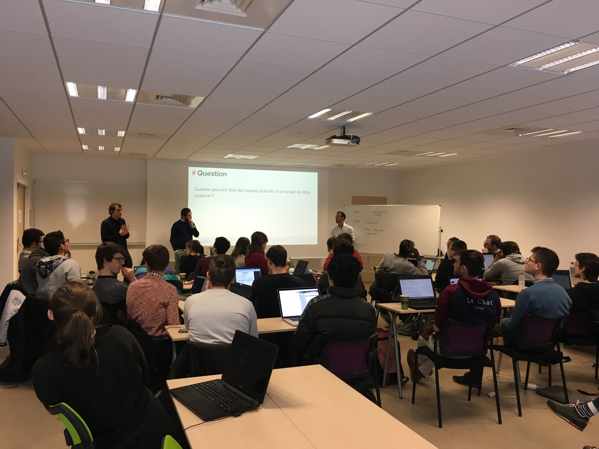

# À la poursuite de Data Venture

Rencontre avec DataVenture, l'association des étudiants de l'UT Compiègne spécialisée en Data Science et IA.
Interview d'[Alexandre Bertolotto](https://www.linkedin.com/in/abertolotto/), [Matt Glorion](https://www.linkedin.com/in/mglorion/), [Sylvain Marchienne](https://www.linkedin.com/in/sylvainmarchienne/) et [Théophile Pace](https://www.linkedin.com/in/pacet/), membres (très) actifs de l'association.

## Parlez nous de l’association, pourquoi l’avoir créée?

L’association a été créée en 2017 sous l’impulsion de Franck Ghitalla, enseignant-chercheur et cartographe à l’UTC. Quelques étudiants se passionnaient pour la Data Science à l’époque et nous nous sommes dits que ça serait cool de découvrir des choses autrement que par des MOOCs ou nos cours. Nous avons donc créé un cadre pour des afterworks où un ou plusieurs étudiants présentent un sujet qui leur plaît. Un autre objectif est de stimuler les projets des étudiants.

## Quelle est votre actualité pour 2019?

Nous venons d’organiser une semaine de cours “La Data Science pour tous” pour 30 étudiants à l’UTC. Entreprises, enseignants-chercheurs et tuteurs-étudiants ont présenté des aspects théoriques et pratiques de la Data Science auprès d’étudiants issus de différents domaines. C’est un projet qui a demandé énormément de travail et qui a été très apprécié par tous les participants.

Pour le reste de l’année, nous allons nous concentrer sur les afterworks à l’UTC, où des étudiants présentent leurs projets personnels ou leurs sujets de stage.

Nous aimerions aussi développer les Pizzaggle (Pizza + Kaggle) pour s’amuser entre étudiants sur des challenges [Kaggle](https://www.kaggle.com/), avec des pizzas pour alimenter les cerveaux ! Cela requiert une bonne préparation et on aimerait trouver des sponsors.

## Qui sont les élèves qui rejoignent l’association?

Pour l’instant, ce sont surtout des étudiants en informatique, mais aussi parfois des étudiants en mécanique ou en biologie ! Cela apporte de la richesse dans nos échanges et ça montre bien le caractère transdisciplinaire de la Data Science. Nous essayons ainsi d’avoir 2 niveaux de conférences : des évènements généralistes pour faire découvrir, et des conférences plus poussées pour les profils informatiques.

## Quels sont les projets types que vous réalisez au sein de DataVenture? Machine/deep Learning? Data Mining?

Il y a beaucoup de projets de Machine Learning et “Big Data” chez les étudiants, l’objectif de l’association est de les regrouper et de les mettre en avant. Sylvain a par exemple utilisé du Machine Learning pour aider à gérer les stocks du foyer étudiant de l’UTC. Léna et François sont en train de mettre en place un cluster Hadoop avec des Raspberry Pi offerts par [Coddity](https://coddity.com). D’autres étudiants travaillent actuellement sur des GANs pour faire du transfert de styles sur des vidéos… Bref, on a vraiment de tout !

## Si c'est le cas, comment travaillez vous avec l'UTC sur la mise en place d'une filière IA et quels sont les échanges académiques?

Il existe déjà quelques cours dédiés à l’UTC, notamment en Machine Learning. Bien que non dédiée 100% à l’IA, la formation permet aisément de s’orienter vers ces métiers. Par ailleurs, les enseignants-chercheurs de l’UTC sont reconnus dans le domaine. Nous avons de très bon échanges avec eux, ils nous soutiennent dans nos initiatives et on est toujours ravis de les accueillir.  L’association nous permet par exemple d’avoir un aperçu de leurs travaux de recherche.

## Quels sont les échanges que vous avez avec le monde extérieur à l’école : entreprises, institutions, associations ou autres ?

Nous avons développé des échanges avec des entreprises, notamment par le biais de diplômés ou de stagiaires en poste dans celles-ci. Ces échanges nous permettent de faire intervenir les entreprises à l’UTC, de découvrir des choses et parfois de lancer des projets. Cela représente également de très bonnes opportunités de stages et CDI pour les étudiants.
Par ailleurs, on essaye de varier les entreprises accueillies et de se concentrer sur un thème par conférence.

## Quelle est la prochaine étape pour DataVenture ? De quoi avez vous besoin pour y parvenir ?

La prochaine étape est de s’ouvrir encore davantage aux étudiants et aux étudiantes, au-delà des filières informatiques. Pour cela, nous avons surtout besoin de gens motivés pour organiser les évènements. Une fois que nous aurons développé ça, nous pourrons commencer à réfléchir à un petit rêve... un hackathon orienté Data au centre d’innovation de l’UTC ! Afin de répondre aux besoins matériels des événements, nous recherchons également des sponsors.

## Question de fond : l’IA est un sujet du moment avec beaucoup de #, que représente-t-elle pour vous ?

L’IA est assez tendance en ce moment en effet, on entend beaucoup de choses à ce sujet. Je pense qu’il faut voir l’IA comme un outil parmi d’autres et pas comme une solution magique, comme la terminologie peut le laisser penser. Il faut analyser et comprendre le contexte d’un problème pour décider si l’IA est une piste appropriée et envisageable.
