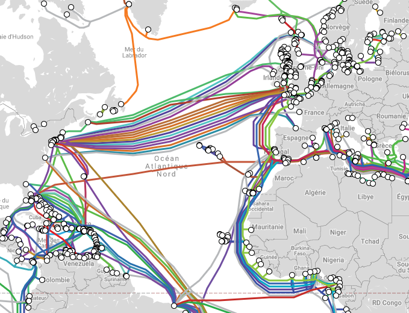
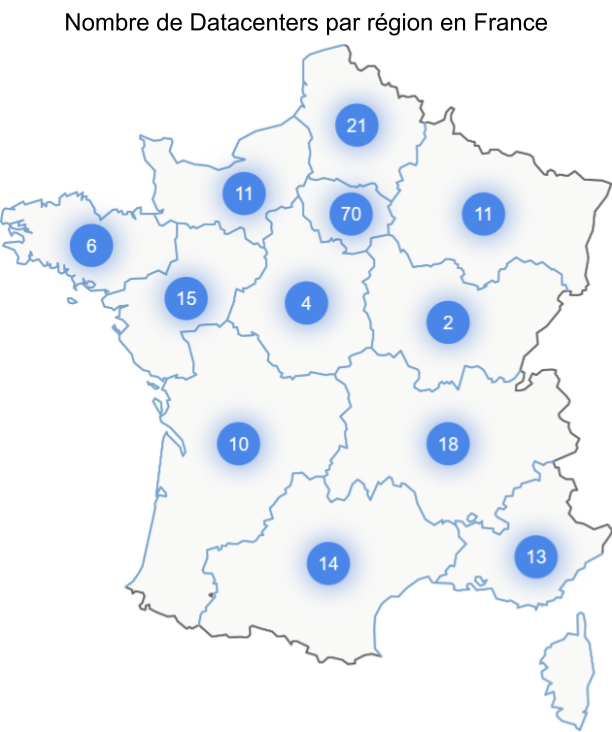
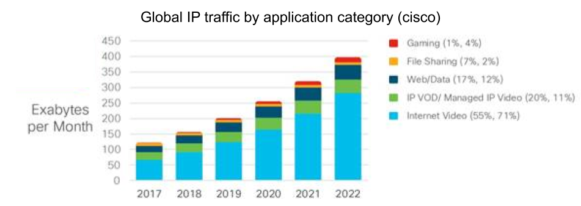
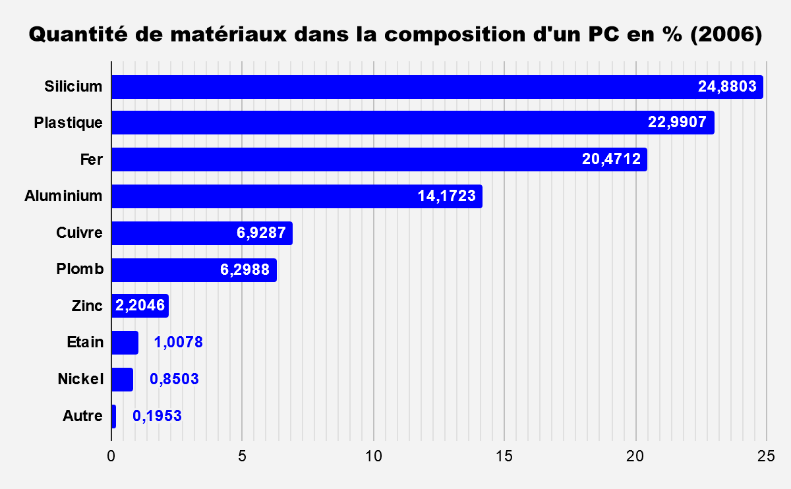
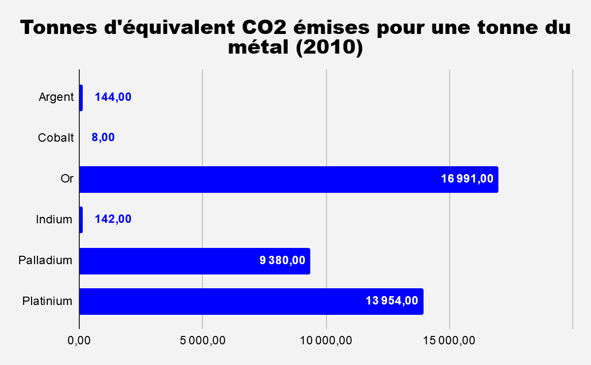

Aujourd’hui, les outils numériques sont omniprésents et nécessaires à de nombreuses tâches quotidiennes, allant des loisirs au travail en passant par l'accès à l’information. Pour la plupart d'entre nous, il nous est impossible de travailler sans ces outils. J’ai voulu en écrivant cet article découvrir sur quoi repose cet avènement du numérique et me faire une idée de ce que représente physiquement cet univers.

  

Je commence par proposer quelques chiffres permettant de décrire l’architecture du monstre numérique dont nos activités dépendent. J’étudierai ensuite nos usages et notre consommation de ces outils avant d’aborder la composition de nos terminaux. Cet état des lieux me permettra de lancer une réflexion sur la place du numérique dans les enjeux énergétiques et environnementaux actuels.

  

À la fin de l’article, je vous proposerai un sondage anonyme sur vos usages du numériques. L’ensemble des sources seront présentes dans l’article ou à la fin de celui-ci.

  

## Le Réseau

  

Si nous utilisons les outils numériques tous les jours, il est difficile de se représenter ce sur quoi ils sont basés. Nous passons notre temps à échanger des informations de manière quasi instantanée, sans se préoccuper de leur parcours. On interroge depuis la France des sites hébergés aux Etats unis tous les jours, on échange avec des personnes à l’autre bout du monde sans aucune difficulté. Pour autant, toutes ces informations ont bien besoin d’un support. Le monde est ainsi couvert d'immenses autoroutes de l’informations que nous utilisons inconsciemment à chacune de nos excursions sur la toile.

  

A titre d’exemple, dans le monde, en 2019, on estime à 1.2 Millions le nombre de kilomètres de câbles sous-marins permettant le transfert de données à travers le monde. La cartographie de ceux-ci est disponible [ici](https://www.submarinecablemap.com/).

*
Cartographie du réseau de câbles sous-marin
*

  
  

Si certain d’entre eux ne font que quelques centaines de kilomètres (entre la France et l’Angleterre par exemple), d’autres dépassent les dizaines de milliers de kilomètres, notamment ceux traversant l'océan pacifique. Certains de ces câbles peuvent atteindre des débits supérieurs à 100 térabits par seconde.

  

Pour ce qui est du réseau terrestre, il est plus difficile d’avoir des données cartographiques récentes. Il peut s’agir d’informations stratégiques pour les entreprises, qui ne sont donc pas rendues publiques. De plus, chaque opérateur dispose de son propre réseau, excepté pour les zones blanches et hors contrats d'itinérance, ce qui augmente les infrastructures nécessaires. Certains chiffres ont tout même été publiés : au niveau de la fibre, orange annonce en 2018 avoir déployé au total plus de 20 millions de kilomètres de fibre optique, soit l’équivalent de 500 fois le tour de la planète.

  

Un autre maillon du réseau internet est l’ensemble des antennes utilisées pour les réseaux mobiles. En france, on compte plus de 210 000 antennes 2G/3G/4G nous permettant d'être connecté en permanence depuis nos mobiles.

  

Il est aussi possible d'accéder à internet via satellite, mais ces technologies sont surtout utilisées pour le rendre accessible dans des zones à faible couverture et ne correspondent qu’à une faible part du trafic global. Cette technologie reste néanmoins nécessaire pour une couverture complète des territoires.

  

## Les Data centers

  

La seconde pierre angulaire de notre monde numérique est le datacenter. En effet, transférer les données n’est pas suffisant, il faut aussi les stocker et les traiter : c’est au coeur des datacenters qu’ont lieu ces actions. Et ce stockage à un coût. En France, en 2015, la consommation des datacenters était estimée à 3 TWh soit plus que celle de la ville de Lyon. Le matériel informatique n’est pas la seule cause de ce besoin énergétique : la climatisation de ces lieux représente entre 30% et 50% de leur facture énergétique. Une autre problématique des datacenters est liée au taux d’usage du matériel. L’ensemble des ressources ne sont pas utilisées en permanence, certaines ne sont nécessaires qu’en cas de panne ou lors de pics d’utilisation. On estime alors à 30% le taux de machines non utilisées mais alimentées dans ces infrastructures.

  

  

En France, on compte 195 datacenters présents en 2018. Cependant, chaque datacenter à une consommation différente en fonction de sa surface et de son optimisation énergétique. À titre d’exemple, en 2012, il était estimé qu’un datacenter de 10.000 m2 a les mêmes besoins en électricité qu’une ville moyenne de 50 000 habitants.

  

Heureusement, différentes études cherchent à optimiser ces outils afin de réduire leur facture énergétique ainsi que leur impact environnemental. Ainsi google affirme sur son [site](https://www.google.com/about/datacenters/efficiency/internal/#measuring-efficiency) atteindre un PUE (indicateur d'efficacité énergétique) de 1.12. C’est à dire que pour 1 watt d’alimentation du matériel informatique, 0.12 watt supplémentaires sont nécessaire pour alimenter les systèmes annexes (la climatisation par exemple). Différentes initiatives utilisent aussi les datacenters comme producteurs de chaleur afin de ne pas perdre cette énergie. Ce système est notamment utilisé à Paris, par exemple pour [chauffer une piscine du 13ème arrondissement.](https://www.lejournaldugrandparis.fr/piscine-de-butte-aux-cailles-teste-datacenter-chauffage-dappoint/)

  

Les problématiques des datacenters ne sont pas limitées à l’alimentation électrique. Leur production de chaleur peut aussi amplifier les effets d'îlot de chaleur urbain selon leur localisation. Ils peuvent aussi poser des problèmes liés à leur consommation d’eau. En Californie, certains datacenters peuvent consommer jusqu’à 1600m3 d’eau par jours pour se refroidir (soit entre 10 000 et 20 000 fois plus que la consommation journalière d’un Français). Cette consommation peut nécessiter un redimensionnement du réseau et un afflux d’eau à traiter dans les villes et causer des problèmes lors des périodes de sécheresse. Là encore des solutions existent, disposer d’un circuit d’eau fermé, mais nécessitant de le refroidir, par exemple.

  

## Les Terminaux et leur utilisation

  

Après cet aperçu du besoin en infrastructures de transport et de stockage, il reste une troisième composante de l’environnement numérique actuel : les terminaux des utilisateurs, c’est-à-dire mon pc, le votre, chaque smartphone… Et l’utilisation que nous en faisons.

  

En 2018, ce sont près de 260 millions d’ordinateurs et 1.4 milliards de téléphones portables qui ont été vendus dans le monde. En France, on comptabilise plus de 8 millions de PC vendus et autour de 20 millions de téléphones portables. En 2018, 75% des français possèdent un smartphone, 45% une tablette et 78% un ordinateur et un français passe, en moyenne, 18h par semaine sur internet, dont 5h à y regarder du contenu vidéo.  Enfin, en 2015 plus de 200 milliards de sms ont été envoyés en France. Pour ce qui est des mails, on s’attend à plus de 290 milliards de mails envoyés dans le monde par jour.

  

À la lecture de ces différents chiffres, il ne faut pas oublier que toutes ces activités numériques nécessitent de l’énergie : nos PC ou nos portables, branchés, consomment, votre routeur ou box internet consomme, chaque donnée que nous émettons ou recevons doit être acheminée et stockée au travers des architectures présentées plus haut, qui elles-mêmes sont alimentées et donc consomment de l’énergie…

  

Par exemple, l’envoi d’un mail standard produirait en moyenne 4g en équivalent CO2. Si ce coût peut paraître anecdotique, il représente une véritable pollution si on le rapport au nombre d’e-mail envoyés chaque jour (290 milliards estimés par jours en 2019). Cependant, malgré leur nombre, ce ne sont pas les mails qui vont le plus consommer, mais plutôt les services de streaming. Ceux-ci prennent une part de plus en plus importante dans le trafic internet et sont moteur de sa croissance, comme l’illustre le graphique ci-dessous.

  

Source :
    <a href="https://www.cisco.com/c/en/us/solutions/collateral/service-provider/visual-networking-index-vni/white-paper-c11-741490.html"> Cisco </a>

  

Sur la plateforme YouTube et [d’après YouTube](https://www.youtube.com/about/press/), chaque mois, 1.9 milliards d'utilisateurs se connectent à la plateforme, et chaque jour un milliard d’heures de vidéos y sont regardées. Cela correspond à plus de 100 000 années de visionnages par jour. Ou presque 80 années de vidéos visionnées à chaque minute. Du côté de Netflix, on compte un milliard d’heures de visionnages par semaine en 2017

  

Ce sont donc des millions de giga de vidéos qui transitent en permanence dans le monde entier (une vidéo d’une heure sur youtube en 1080p pèse entre 1.5 et 3 Go). Ainsi on estime que 80% de l’usage d’internet est lié aux contenus vidéos.

  

Enfin, quelques chiffres d’un autre acteur majeur du streaming vidéos sur un secteur lui aussi très fréquenté et qui publie régulièrement ses statistiques, permettant d’avoir une vision plus précise du coût du streaming : le site pornhub. La plateforme affirme que chaque minute, c’est 207 405 vidéos qui sont regardées soit 10 498 heures de vidéo, plus deux heures de vidéo uploadées. Cela, combiné avec le reste des systèmes du site (message, navigation, pub…) correspondrait à 7.708 Go de données transférées. Autre élément intéressant, le site fait part que les utilisateurs recherchaient en 2017 du contenu en 1080p, alors que l’année 2018 aura vu une percée des recherches pour de la 4K (~4 fois plus de pixel qu’en 1080p). Or, le visionnage de vidéo de plus haute définition augmente directement la quantité de données transférées, donc le coût énergétique de la navigation sur le site. De nombreuses autres statistiques d’utilisation directement publiées par pornhub sont disponibles [ici](https://www.pornhub.com/insights/2018-year-in-review).

  

Pour terminer l’étude de notre utilisation du numérique, quelques chiffres sur les réseaux sociaux. J’ai pu les trouver sur le blog du modérateur. Pour facebook, en 2018, c’est 240 milliards de photos présentes sur la plateforme, plus de 4000 statuts partagés par seconde et 10 milliards de messages envoyés par jour. Au total, c’est 350 Go de données partagées à chaque minute. Pour instagram, d’après l’articles du blog du modérateur des chiffres 2018, c’est 95 millions de photos et vidéos postées chaque jour. Pour twitter c’est 500 millions de tweets chaque jour. Pour snapchat, 3 milliards de snaps chaque jour.

  

De plus, afin de garantir leur accessibilité et pour prévenir les pannes, les données stockées en ligne le sont de manière redondante. Une même donnée existe donc en plusieurs exemplaires sur les serveurs, multipliant ainsi leur volume et leur coût de stockage.

  

À tous ces usages s’ajoutent encore de nombreux autres : le traitement de ce “Big data”, les sites web hébergées sur des serveurs qui tournent, les publicités, les jeux vidéos en lignes, les applications que l’on télécharge sur son smartphone et leurs mises à jour…

  

## La compositions de nos terminaux

  

L’utilisation du numérique à un coût énergétique, visible par l’utilisation de nos terminaux, leur chargement, mais aussi invisible de par l’utilisation du réseau et de datacenters pour le transfert, la lecture et le stockage de tous ces contenus. Mais il existe encore un autre grosse source de pollution qui nous impute directement de part l’utilisation de nos PC et smartphones, et qui existe aussi pour tout le reste de l’infrastructure du numérique, c’est celui de l’extraction des matériaux et de la production de nos outils technologiques.

  

Même si les données suivantes sont déjà anciennes vis-à-vis de l’évolution du secteur du numérique, elles permettent de se faire une idée de la composition d’un ordinateur.

  

  

L'extraction et l’utilisation de ces matériaux est une source de pollution : par exemple en 2017, pour une tonne d’aluminium produite, on compte plus de 7 tonnes d’équivalent CO2 émises. Pour le cuivre, on est à 1,4 Tonnes d’équivalent CO2 par tonnes produites

  

Cependant, même si ces composants représentent plus de 99% de la composition d’un ordinateur, il y a au total plus d’une trentaine de matériaux différents dans un PC. Mais la majeur partie y sont en très faible quantité, notamment les suivants (toujours d’après les données de 2006) :

-   L’argent avec 0,0189%
    
-   Le cobalt avec 0,0157%
    
-   l’or avec : 0,0016 %
    
-   L’indium avec 0,0016 %
    
-   Le Palladium avec 0,0003 %
    
-   Le platinium avec moins de 0,0002%
    

  

Pour autant, ils sont aussi très coûteux en extractions, ils participent donc aussi à la pollution émise pour produire nos ordinateurs.

  

  

L’or, malgré sa faible proportion, rivalise donc en capacité de pollution avec les autres composants des PC. Cependant, n’ayant pas de données aux même dates et pour tous les éléments, j’ai préféré ne pas proposer ici de comparaisons chiffrées.

  

Une autre problématique de nos terminaux vis-à-vis de leur composition est celle du recyclage. Autant, certains de ces matériaux peuvent se recycler, autant, dans le cas d’un ordinateur ou téléphone portable cela devient vite compliqué. En effet, tous ces composants sont “mélangés” et il devient donc complexe et coûteux de les séparer pour les recycler et réutiliser.

  

Bien sur, nos terminaux ne sont pas les seules briques du numérique à nécessiter des ressources, l’ensemble du réseau et des infrastructures physique autour de celui-ci aussi ont les mêmes problématiques. Enfin, si leur production est énergivore, il ne faut pas oublier les autres coûts énergétiques que sont le transports et le stockage de toutes ces marchandises, souvent produites et assemblées aux quatres coins de la planète, mais que je n’ai pas souhaité détailler dans l’article.

  

## Les enjeux du Numérique

  

À ce stade nous avons donc un état des lieux assez large de ce que représente le numérique : du transport d’informations, du stockage, des terminaux et de l’utilisation que nous en faisons.

  

Au vu de toutes ces données, on ne peut ignorer leur lien direct avec les enjeux énergétiques et environnementaux actuels : notre sur-consommation d’énergie, la raréfaction des ressources et à la nécessité de réduire notre empreinte carbone. Il est primordial aujourd’hui de prendre en compte le coût “écologique” de nos outils et de nos nouveaux modes de vie suite à cette révolution numérique. L’idée n’est pas ici de diaboliser le numérique, mais de pousser une réflexion sur les moyens à mettre en oeuvre pour adapter ce secteur aux enjeux environnementaux actuels et pas uniquement à ceux économiques et de croissance.

  

En prenant en compte l’ensemble de l’état des lieux précédent, le numérique aujourd’hui représente autour de 3.7% des émissions globales de gaz à effet de serre. À titre de comparaison, l’aviation représente entre 1.5% et 3% de ces mêmes émissions.

  

Pour ce qui est de la décomposition de cette empreinte carbone, elle trouve ses causes :

-   à 50% dans la production de nos terminaux et l’extraction des ressources nécessaires
    
-   à 50% dans leur utilisation, utilisation qui se décompose elle-même à :
    -   ⅓ par l’utilisation du réseau
    -   ⅓ par les datacenters
    -   ⅓ par le périphérique en lui-même et son utilisation
  

De plus, l'empreinte énergétique du numérique à croissance forte, autour de 8 à 9% par an. À terme, le numérique pourrait donc consommer plus d’énergie que le transport en voiture par exemple.

  

Enfin, comme vu précédemment, ces outils sont difficiles à recycler donc peu recyclés, produisant donc d’autres types de pollution non abordés ici.

  

Il ne faut cependant pas uniquement observer les aspects négatifs du numérique, ils permettent aussi de limiter l’utilisation d’énergie dans d’autres secteurs, mais ces éléments seront développés dans un prochain article.

  

Il est donc aujourd’hui nécessaire pour le numérique de se transformer pour devenir plus durable, de la même manière que nos modes de transport ou de consommation nécessitent d'être repensés.

  

## Pistes de réflexion pour répondre à ces enjeux

  

Heureusement, les enjeux du numérique ne sont pas sans solutions. Pour ma part, je crois que le principal levier est celui de l’information et de l’éducation. Une éducation qui ne doit pas être limitée aux nouvelles générations, car les enjeux sont actuels et doivent être abordés avant l’arrivée des générations futures. En effet, je pense que ces enjeux ne sont pas aujourd’hui mis en avant comme peuvent l'être les autres axes de sobriété énergétiques. Il y a un manque d’éducation à une utilisation sobre du numérique. Si on veut rendre durable le numérique, nous devons ré-apprendre à l’utiliser.

  

De nombreuses de nos habitudes sont à revoir :

-   Augmenter la durée entre deux changements de son téléphone portable : la production de nos terminaux est responsable de 50% de la pollution. Plus on garde son portable, son pc, sa tablette...longtemps, plus on limite cette pollution.
    
-   Limiter la qualité des vidéos que l’on regarde : est-ce vraiment nécessaire de regarder des vidéos en 4k sur un écran de smartphone ? Pourquoi garder une qualité de vidéo élevée quand on écoute simplement de la musique ? Plus la qualité est élevée, plus la quantité de données à transférer sur le réseau est forte, plus cela consomme.
    
-   Limiter sa consommation de vidéo et streaming sur internet
    
-   Limiter la quantité de contenus inutiles que l’on stocke “dans le cloud” ou publions tel que nos photos ou nos mails, qui seront dupliqués des dizaines de fois, et transitent sur le réseau à chacun de nos affichages de ceux-ci. De même pour nos snaps ou nos story sur les réseaux sociaux.
    
-   Éteindre nos dispositifs, pourquoi laisser allumer son PC la nuit quand il se démarre en quelques secondes, éteindre sa box internet quand elle est inutilisée.
    
-   Supprimer nos applications inutiles de nos portables afin d’éviter les mise à jour inutiles.
    

  

Si ces actions peuvent être prises d’un point de vue individuel, d’autres dépendent plus des entreprises ou de nos services publics.

  

-   Utiliser les datacenters comme source de chaleur afin de chauffer des bâtiments ou d’autres infrastructures. Même si cette solution ne diminue pas directement les émissions du numérique, elle permet d’économiser de l’énergie ailleurs. Il ne faut pour autant pas négliger leur optimisation énergétique.
    
-   Limiter la redondance du stockage d’informations pour les données non-critiques afin de limiter le besoin en stockage.
    
-   Utiliser le cloud pour publier ses sites ou service si cela peut permettre d’éviter de sur-dimensionner un serveur dont les capacités ne seront utilisées qu’un à deux jours par an (tel que les sites d’e-commerce lors du black friday par exemple). En effet, les technologies cloud permettent aujourd’hui d’allouer des ressources en fonction des besoins.
    
-   Réfléchir au besoin de faire tourner des sites et service 24h sur 24 quand ceux-ci ne sont pas utilisés la nuit par exemple. L’accessibilité permanente des services informatique est aujourd’hui la norme, mais est elle réellement en adéquation avec les enjeux énergétiques actuels ?
    

  

Une dernière solution, que je souhaiterais développer dans un prochain article est de combattre l’obésité logicielle. Aujourd’hui nous travaillons avec des machines de plus en plus puissantes sur des réseaux aux capacités croissantes. Les problématiques d’optimisation sont donc beaucoup moins forte et on peut se permettre de produire des logiciels et applications plus gourmandes, plus lourdes, plus consommatrices. Cependant, il est nécessaire de se contraindre à optimiser fortement notre utilisation des ressources informatiques pour un numérique durable et ce dès les phases de conception. Cela peut même nous amener à nous questionner sur la pertinence de l’arrivée des technologies 5G et de l’IoT ([Internet of Things](https://fr.wikipedia.org/wiki/Internet_des_objets)) qui vont encore démultiplier nos usages du numérique.

  

## Conclusion

  

Au cours de cet article, nous avons donc pu aborder un échantillon des différentes réalités physiques qui composent le numérique actuel afin de comprendre son importance, non pas dans notre mode de vie et notre société, mais dans son impact énergétique et donc environnemental. S’il révolutionne nos vies, il ne faut pas négliger sa consommation et réfléchir dès aujourd’hui à des moyens de rendre cette révolution technologique viable vis-à-vis des enjeux climatiques auquel nous devons faire face. J’espère vous avoir apporté une nouvelle vision du numérique et permis de réfléchir sur ce sujet. Dans l’optique de prochaines publications, je vous propose de remplir ce questionnaire anonyme autour de vos habitudes numériques. Il me permettra, si je dispose de suffisamment de réponses, de proposer quelques chiffres autour de notre consommation.

[Questionnaire anonyme sur votre utilisation du numérique](https://docs.google.com/forms/d/e/1FAIpQLSfIaksXVjumz3tvHDg5bss6MSzycsIcolTZqqrxJNxU_9cJHg/viewform?usp=sf_link)

  

# Sources

  

[Communiqué d’orange sur la fibre](https://www.orange.com/fr/Press-Room/communiques/communiques-2019/2018.-annee-de-tous-les-records-en-matiere-de-deploiement-de-la-fibre-pour-Orange) , [Carte des datacenters](http://www.globalsecuritymag.fr/fichiers/gsm42/ABONNES/CARTE-DC-50x70HD.pdf), [Rapport ENERNUM](https://www.connaissancedesenergies.org/sites/default/files/pdf-pt-vue/RAPPORT_ENERNUM_FINAL-_1mars2019.pdf), [Statistique de l’INSEE](https://www.insee.fr/fr/statistiques/3303452?sommaire=3353488), [Statistiques de l’ARCEP](https://www.arcep.fr/uploads/tx_gspublication/barometre-du-numerique-2018_031218.pdf), [Statistique Email](https://www.arobase.org/actu/chiffres-email.htm), blog du modérateur : [Facebook](https://www.blogdumoderateur.com/chiffres-facebook/)  [Instagram](https://www.blogdumoderateur.com/chiffres-instagram/)  [Twitter](https://www.blogdumoderateur.com/chiffres-twitter/)  [Snapchat](https://www.blogdumoderateur.com/chiffres-snapchat/), [Chiffres netflix](https://expandedramblings.com/index.php/netflix_statistics-facts/), [chiffres pornhub](https://www.pornhub.com/insights/2018-year-in-review), [Rapport Metal Recycling Opportunities, Limits, Infrastructure](https://www.wrforum.org/wp-content/uploads/2015/03/Metal-Recycling-Opportunities-Limits-Infrastructure-2013Metal_recycling.pdf), [emprunte de l’aluminium](http://www.bilans-ges.ademe.fr/documentation/UPLOAD_DOC_FR/index.htm?aluminium.htm), [faq câbles sous-marins](https://www2.telegeography.com/submarine-cable-faqs-frequently-asked-questions), [Rapport shift project Lean ICT](https://theshiftproject.org/wp-content/uploads/2018/11/Rapport-final-v8-WEB.pdf), [statistiques de couverture mobiles](https://www.couverture-mobile.fr/?page=statistiques), [economie digital et efficacité énergétique (conférence)](https://www.youtube.com/watch?v=orbZwZSHYkY), [L’efficacité énergétique dans les datacenters](https://www.actu-environnement.com/media/pdf/news-27968-data-center-atee.pdf), [cisco](https://www.cisco.com/c/en/us/solutions/collateral/service-provider/visual-networking-index-vni/white-paper-c11-741490.htmlhttps://www.cisco.com/c/en/us/solutions/collateral/service-provider/visual-networking-index-vni/white-paper-c11-741490.html)