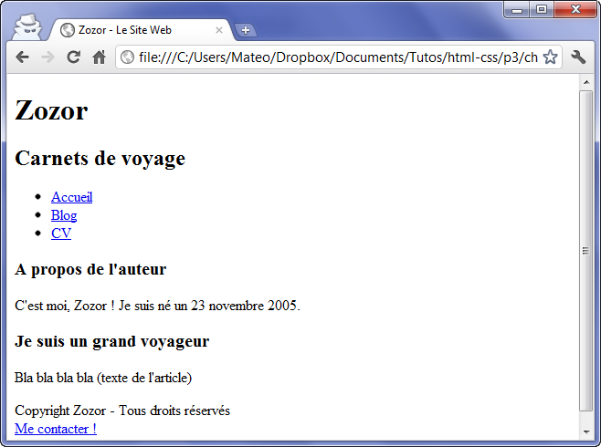
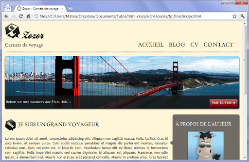
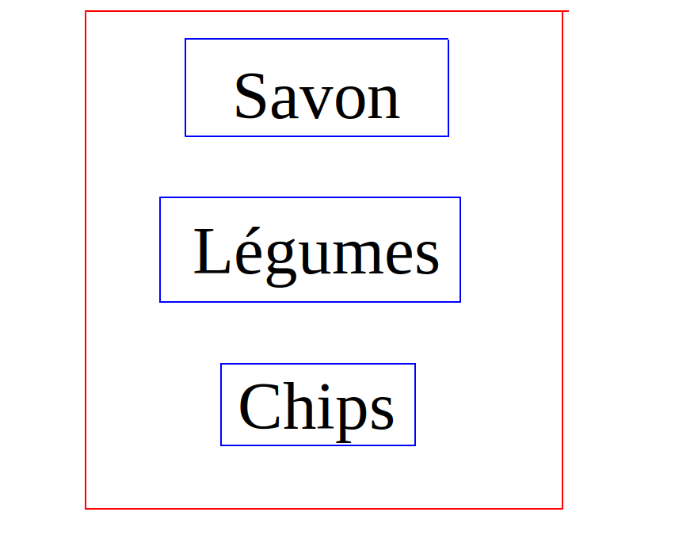
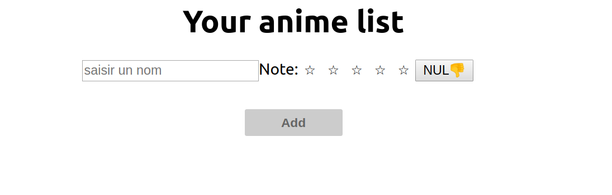
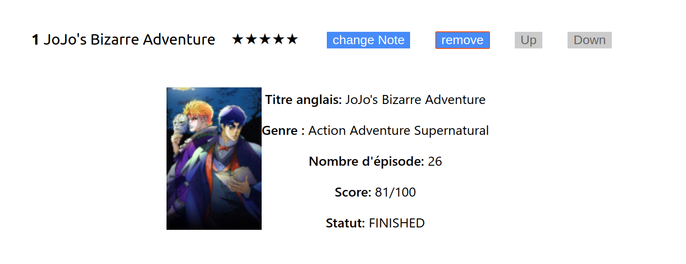
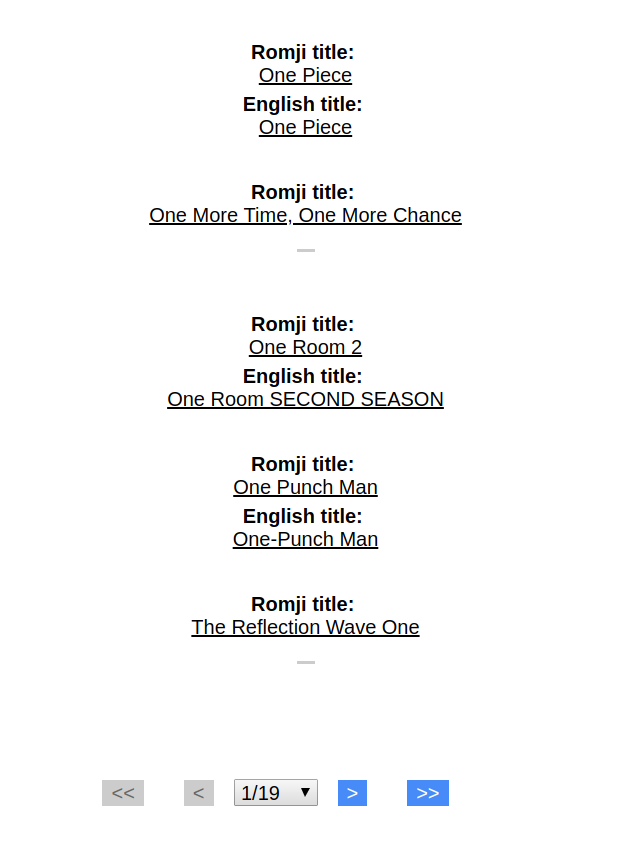

Je m’appelle Benoit Rams et je suis actuellement en 4ème année à l’Université de Technologie de Compiègne (UTC) en génie informatique. Dans le cadre de mes études, je dois effectuer deux stages de six mois. Pour ce premier stage, j'intègre Coddity en tant qu'**Artisan web front-end**. Coddity est une petite entreprise française d’une vingtaine de salariés spécialisés en développement web et en data science.

Afin d’accomplir ma mission, je dois programmer avec **des langages web.** Cependant je n’ai fait que très peu de développement web jusqu'à maintenant, j’ai seulement étudié le HTML et le CSS en autonomie il y a longtemps. Durant ma scolarité, j’ai principalement **codé en C et C++** et j’ai **quelques notions en Python et SQL**. Dans cet article, je vais surtout vous raconter mon expérience de l'apprentissage des technos phares de Coddity.

### Pour bien commencer

Lors de mes premières journées, j’ai dû revoir **les langages HTML et CSS**, dont j'avais complètement oublié la syntaxe. Ali, CTO de Coddity et tuteur de stage, m’a conseillé de regarder [le bootcamp front-end de Microsoft](https://github.com/microsoft/frontend-bootcamp) dont les 3 premiers chapitres traitent le HTML, le CSS et le JavaScript vanilla. La documentation est bien détaillée et assez facile d’accès pour les débutants comme moi.

## HTML, la base de tout site web

Le HTML est un **langage à balises qui permet de placer les éléments dans une page web** (le texte, les images, etc). Chaque élément d’une page est **représenté par une balise**.

```html
<h1> la balise h1 correspond à un titre de 1er niveau </h1>
<p> la balise p correspond à un paragraphe </p>
```

Une balise peut contenir un certain nombre d’attributs, permettant de personnaliser l’élément ou de le lier à un événement (un clic droit ou bien lorsque la souris passe par-dessus, etc.).

La syntaxe HTML est assez simple (il suffit juste d’écrire des balises), cependant l’une des difficultés est **de bien connaître les différentes balises et leurs attributs**. L'autre difficulté consiste à **bien positionner les balises afin d’obtenir le résultat souhaité**.

## CSS ou comment décorer votre site

Quant au CSS, c’est un langage qui **prend en charge la mise en forme des pages web** (la couleur du texte, la taille du texte, la position des élément dans la page, etc.). Le CSS ne peut pas être utilisé sans le HTML, mais le contraire est possible. Un code CSS va être relié à une ou plusieurs pages HTML.

Voici un site sans CSS :



Voici un site avec du CSS:


<center>source: <a href="https://openclassrooms.com/fr/courses/1603881-apprenez-a-creer-votre-site-web-avec-html5-et-css3/1605060-mettez-en-place-le-css)">openclassroom</a></center>

Comme le HTML, le CSS a une syntaxe assez simple mais cela peut devenir **complexe sur de gros projets**. Dans ce cas de figure, il existe des alternatives facilitant la mise en page d’un site (nous en parlerons dans un autre article).

Le HTML et le CSS ne sont pas des langages de programmation (comme le C++ ou le JavaScript). Ils ont **une vocation beaucoup plus graphique**.

## JavaScript, la possibilité d’interagir avec votre site

Le JavaScript est **un langage de programmation** (comme le C ou le Python), initialement créé dans le but de dynamiser les pages HTML (menus déroulants, effets, etc.). Aujourd'hui, il permet **une interaction entre l’utilisateur et l’application web**. Illustrons par un exemple : l’utilisateur clique sur un bouton => le JavaScript réalise  l’ensemble des changements sur la page (apparition de nouveau contenu, ajout d'un élément dans une liste, etc.).

Le JavaScript est un langage de **très haut niveau**, c'est à dire qu'il comporte de nombreuses fonctions qui facilitent le développement. C’est très important pour moi car je suis surtout habitué à des langages de moins haut niveau (tels que le C ou le C++). J'ai été surpris par de nombreux aspects. Par exemple, il y a plusieurs façon d’écrire les fonctions (syntaxe “classique” ou fonction fléchée), ce qui peut rendre le code compliqué pour un débutant. Ou encore, on ne déclare pas le type des variables, les objets n’ont pas besoin de classe parente, etc.

Selon moi, la difficulté principale en JS est de **bien optimiser son code** car le langage est **très permissif**.

-------------

HTML, CSS et JS sont des prérequis avant d’utiliser React, qui va nous permettre de créer des sites de manière simple et dynamique.

## React 

React est **une bibliothèque JavaScript créée par Facebook en 2013**. Elle facilite **la création d’application web monopage** (contenant qu’une seule page). Elle s’occupe uniquement du front-end d’un site. De nombreux sites web à fort trafic sont développés en React : Netflix, Airbnb, Yahoo.

De nos jours, React s’est démocratisé et est devenu l’un des frameworks les plus utilisés en France. Pour débuter, je conseille le [tutoriel officiel de React](https://fr.reactjs.org/tutorial/tutorial.html) qui fournit les bases.

### Comment ça marche?

React utilise des **«composants»** qui vont correspondre à une **portion d’une page web**. Un composant peut en contenir un autre, et on a généralement **un composant principal et unique qui contient tous les autres**. Prenons un exemple, avec une liste de course : la liste est notre composant principal, et elle contient d’autres composants : les articles à acheter.




Dans l’exemple ci-dessus, le rectangle rouge est le composant principal et les rectangles bleus sont les composants contenant les éléments de la liste.

Et pour combiner HTML et React, on utilise une syntaxe assez étrange : le JSX.

### Qu’est-ce que JSX?

JSX (JavaScript eXtension) est **une extension syntaxique de JavaScript**. Même si c’est cela n’est pas obligatoire, le JSX est fortement recommandé si l’on veut créer des composants React. Il permet de **créer des éléments HTML dans un code Javascript**.

Il est aussi possible de **rajouter du code JavaScript dans les codes HTML du JSX**. Cependant, on ne peut pas tout faire en JSX : il n’est pas possible **d’ajouter des conditions if-else ou des boucles**. Il est cependant possible d'utiliser les conditions ternaires ou d’appeler des fonctions.

### Le fonctionnement de React

Certaines choses sont à savoir pour utiliser React (même pour des petits projets). Tout d’abord, il faut créer des composants qui sont essentiels pour des projets React. Il existe deux manières de créer un composant React:

1.  **En utilisant les classes**
    
2.  **En utilisant les fonctions.** 

Je préfère créer des composants avec une classe pour plusieurs raisons. Premièrement, je suis habitué au C++ qui est un langage orienté objet. Dans ce type de langage, on crée souvent des classes (permettant la création d’objet), et les fonctions ne font qu’exécuter des instructions.

Deuxièmement, **il est uniquement possible de créer un état local** dans un classe. Donc si on a créé un composant avec une fonction et qu’on veut lui assigner un état local, on est obligé de le redéfinir, ce qui n’est pas très pratique. Dans les dernières versions de React cependant, on peut créer une **fonction avec un état local grâce aux Hooks** (mais je ne sais pas encore les utiliser donc je n’en parlerai pas).

Une fois notre composant créé, il faut qu’il affiche un code HTML afin d’être visible par l’utilisateur. Si notre composant est issu d’une classe, il **doit contenir la méthode render() qui retourne un code HTML**. C’est dans cette méthode qu’on utilise du JSX.

Ensuite il faut définir les props et l’état local de vos composants. Ce n’est pas obligatoire mais cela s’avère souvent nécessaire si vous voulez une application web dynamique. Pour résumer **les props sont les arguments que l’on va fournir à un composant**, accessibles uniquement en lecture. **L’état local est l’état du composant pouvant contenir de multiples propriétés**. Si je faisais une comparaison avec le C++, les composants sont des classes, les méthodes sont des fonctions, les props sont des arguments dynamiques exploitables par le composant, l’état local sont les attributs de la classe.

### Mon ressenti sur React

Avant de se lancer dans un projet React, il faut concevoir l'interface sous forme de composants, accompagnés de leurs state et props respectifs. La complexité réside dans **l'architecture : la hiérarchie et l'imbrication des composants**.

Ensuite, la gestion des événements n’est pas forcément compliquée. Cependant, certaines règles syntaxiques m’ont posé problème : l'opérateur _this_ notamment. En effet, il est obligatoire si on souhaite appeler une méthode ou une propriété de la classe courante (contrairement au C++) et les méthodes propres ne sont pas automatiquement atteignables sans l'opération de _bind_ ou la fonction fléchée. C'est assez obscur lorsqu'on débute...

### Fonctionnalités avancées de React

Quelques fonctionnalités sont assez pratiques, à mon avis. Tout d’abord, parlons de TypeScript, **un langage qui a pour but de sécuriser les données en JavaScript**. Son fonctionnement est simple, il demande entre autre de déclarer toutes les variables au préalable. Cela permet d’apporter une plus forte cohérence et rigueur dans le code.

Par ailleurs, React permet l'utilisation de librairies externes qui accélèrent le développement. Par exemple, UIFabric : le framework de design de Microsoft. Il permet aux utilisateurs d’utiliser des composants préfabriqués et d’implémenter un style graphique facilement dans une page web. Cela est surtout pratique pour le rendu HTML d’un composant.

## Mon application web

Afin de mettre en oeuvre mes nouvelles connaissances, j’ai développé un site qui permet à un utilisateur de créer sa propre liste d’animes japonais.

Le principe est simple, l’utilisateur saisit le nom d’un anime et lui attribue une note (entre 0 et 5). Ensuite il peut l’ajouter dans une liste. Une fois dans la liste, il est possible de le supprimer ou de changer sa note. La liste est triée par ordre décroissant de note.



Voici l’interface de mon application lorsque l’utilisateur n’a pas encore d’élément dans sa liste.

### Fonctionnalités de base de mon application

La plus grande difficulté fut de définir la bonne structure de données pour ma liste. **Il m’a aussi été difficile de créer de bons composants en utilisant le CSS et le HTML**. Etant donné que je ne suis pas encore habitué à ces 2 langages, créer un site avec une belle interface graphique ne m'est pas facile.

Après avoir fini la base de mon site, j’ai décidé de l’améliorer en intégrant une fiche descriptive pour chaque anime contenant photo, nombre d’épisodes, date de sortie etc. Pour ce faire, j'ai utilisé une API assez spéciale : Anilist.

### GraphQL et les API

Avant d’utiliser Anilist, je me suis documenté sur un outil essentiel : GraphQL. **C’est un langage de requête pour API**, c’est-à-dire que GraphQL va chercher l’information dans une API en fonction de ce que l’utilisateur va entrer. Une API est une source de données externe, publique ou non, interrogeable gratuitement ou non.

J'ai utilisé GraphQL pour interroger l'API Anilist, qui permet **de rechercher des animes et des mangas** dans une grande base de données. Pour cela, il est impératif de savoir comment formuler une requête GraphQL compatible avec Anilist.



<center>Une fiche d’anime créée grâce à l’API Anilist</center>

La plus grande difficulté est de bien comprendre les principes de base de GraphQL et de savoir comment on utilise une API en général. De mon point vue, ce n'est pas difficile (la documentation est bien fournie), mais implémenter ces fonctionnalités dans une application React l'est un peu plus.

Grâce à cette API, j’ai pu ajouter des fiches à chaque élément de ma liste ainsi qu'un **moteur de recherche d’anime dans ma base de données**.



<center>Première page du moteur de recherche lorsque l’utilisateur tape “one p”</center>

Une autre fonctionnalité simple d’utilisation est **le localStorage, qui permet de stocker temporairement les données de notre application web**. Ainsi, si on rafraichit la page web, les données ne seront pas perdues. Attention, le localStorage stocke les informations localement, il ne peut donc pas se substituer à une base de données partagée.

## Conclusion

J’ai beaucoup appris sur le développement web durant ces 2 premières semaines chez Coddity. Même si j’ai rencontré des difficultés durant mon initiation, l’équipe Coddity était toujours présente pour m’aider. En outre, je fais de la programmation depuis 3 ans et cela m'a été utile pour ma formation. Cependant, je ne conseillerais pas React aux débutants en programmation car sa prise en main peut paraître assez compliquée.