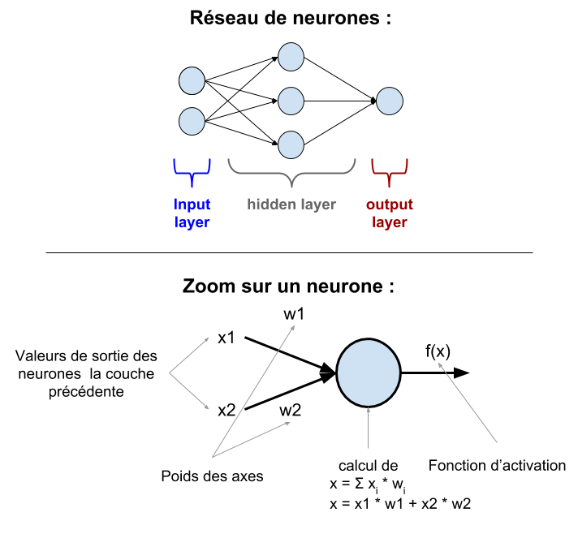
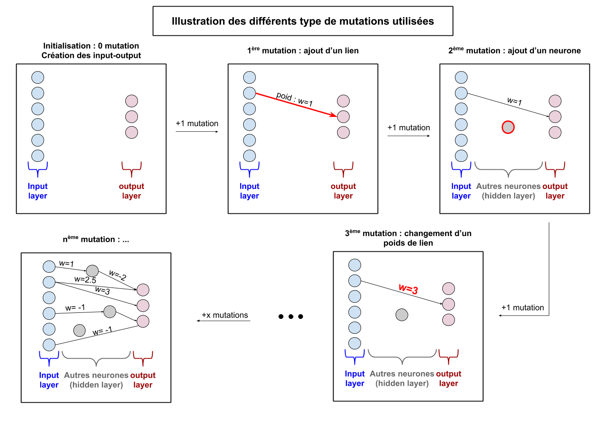
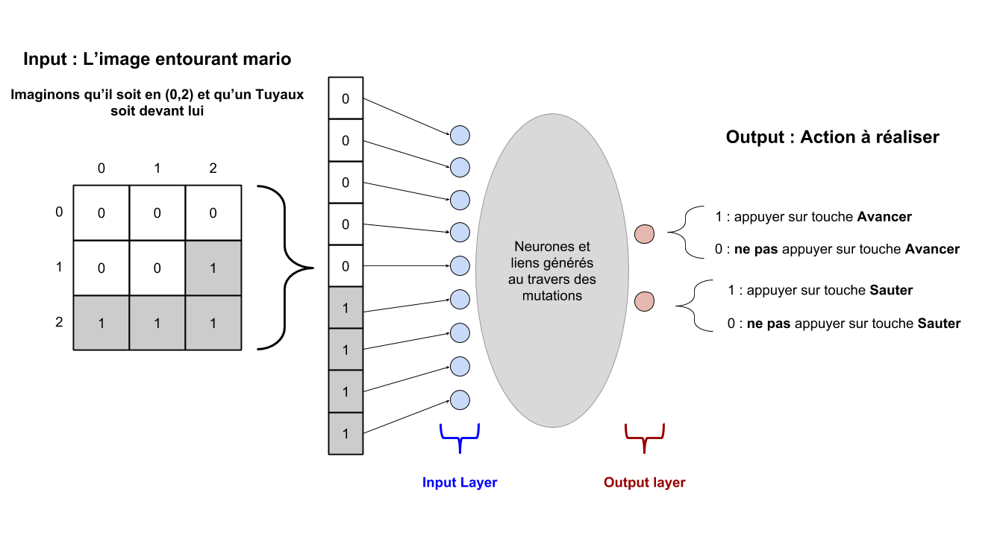
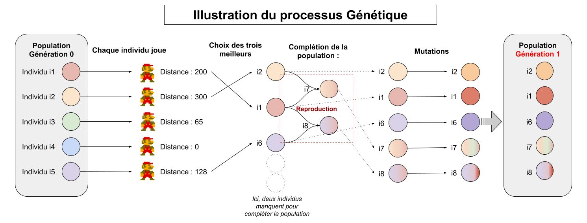
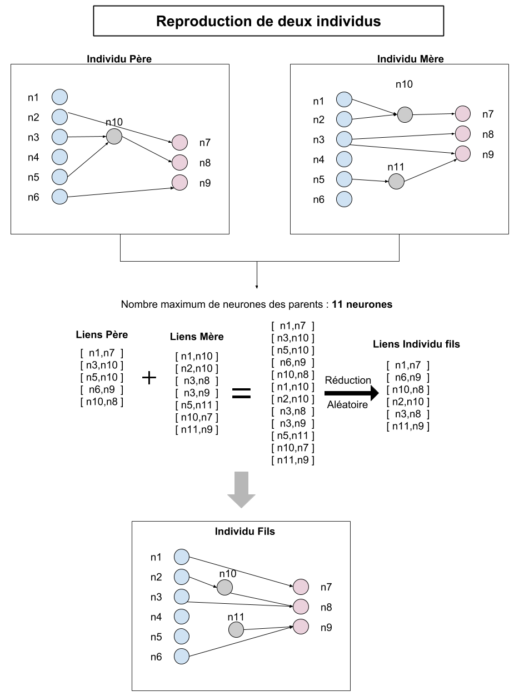
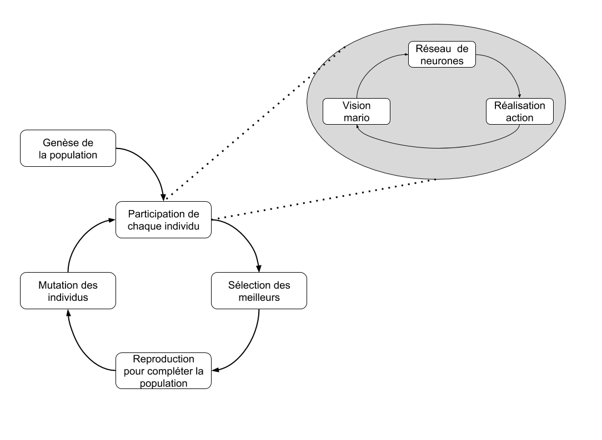

Cet article présente mon retour d’expérience sur la façon dont j’ai réussi à finir le premier niveau de _Super Mario Bros. 1_ de façon automatique. Pour cela, j’ai utilisé un algorithme génétique qui construit des réseaux de neurones capables de jouer et potentiellement d’arriver au fameux drapeau de fin de niveau !

De fait, cet article présente une utilisation possible d’un algorithme génétique afin de paramétrer un réseau de neurones. Il s’adresse aux personnes intéressées par les réseaux de neurones et les algorithmes génétiques (ainsi qu’aux fans de Mario !).

# Contexte

Dans le cadre de l’Atelier Coddity, dédié à l’expérimentation technique, j’ai lancé le développement d’un logiciel visant à terminer le premier niveau de Super Mario Bros. 1 automatiquement.

Comment Mario peut-il terminer le niveau seul ? Une solution serait de lui donner des règles à suivre, basées sur mon expérience du jeu, afin qu’il soit capable de jouer correctement. Par exemple, si il y a un ennemi une case devant : sauter. Cependant, je voulais aller plus loin, je voulais que mon “logiciel” soit capable d’apprendre à jouer tout seul, de trouver lui-même quelles règles suivre pour finir le niveau ! Je me suis donc tourné vers les algorithmes génétiques. L’idée ? Générer plusieurs Marios et les faire évoluer petit à petit en gardant les meilleurs d’entre eux. Et comment ces Marios vont-ils déterminer leur façon de jouer ? À l’aide d’un réseau de neurones ! C’est lui qui évoluera avec mes Marios au travers de l’algorithme génétique. C’est tout ce processus que vous découvrirez au cours de cet article.

Bien entendu, j’ai dû identifier un logiciel permettant de jouer à Mario qui soit compatible avec Python, langage sur lequel j’ai choisi de travailler. Afin de limiter les problèmes d’interactions avec l’émulateur et ainsi me concentrer sur le coeur de la problématique, j’ai choisi la solution suivante : [https://github.com/justinmeister/Mario-Level-1](https://github.com/justinmeister/Mario-Level-1])

Il s’agit du premier niveau de Mario entièrement fonctionnel et réalisé en python à l’aide de [Pygame](https://www.pygame.org/wiki/about). Cette version a permis d’y intégrer directement le code du réseau de neurones et de l’algorithme génétique, simplifiant ainsi l’interface entre le jeu et notre code.

# Mise en oeuvre

## Le réseau de neurones

Afin de gagner en flexibilité et de manipuler les réseaux de neurones, j'ai choisi de ne pas m'appuyer sur des librairies existantes comme Keras.

La figure suivante permet de rappeler de manière simplifiée le fonctionnement d’un réseau de neurones classique.

Au niveau du code, deux [classes](https://fr.wikipedia.org/wiki/Classe_(informatique)) composent notre modèle :

- Le **neurone**, il contient une liste d’inputs avec les poids associés, une liste d’outputs et sa valeur, ainsi qu’une méthode pour calculer sa propre [fonction d’activation](https://fr.wikipedia.org/wiki/Fonction_d%27activation).

- Le **réseau**, il contient trois listes de neurones : les inputs (input layer), les outputs (output layer) et les autres (hidden layer). Différentes méthodes permettant de générer le réseau et d’y ajouter des neurones et des liens. Afin de ne pas complexifier le modèle, aucun système de couche n’a été mis en place : le réseau n’est pas entièrement connecté. Enfin, une méthode permet de calculer le réseau à partir d’une liste de valeurs en input.

Je peux désormais générer et calculer la sortie d’un réseau de neurones. Celui-ci pourra prendre les décision sur les actions que doit réaliser Mario à un instant donné. On va maintenant chercher un moyen de faire évoluer ce réseau de neurones.

# L'algorithme génétique

J’ai ensuite construit la structure de l’algorithme génétique. Mais avant de détailler ce point, de quoi s’agit t-il ?

Il s’agit d’un algorithme qui va générer une population d'individus dont l’objectif est de résoudre une tâche le mieux possible : il s’agit donc d’un problème d’optimisation. Pour ce faire il va utiliser les principes de l’évolution en biologie. Il va donc créer une population et la faire évoluer via des processus de mutation, de sélection et de croisement afin d’obtenir les individus les plus efficaces pour résoudre la tâche donnée. La tâche peut par exemple être de trouver le maximum d’une fonction ou, dans notre cas, terminer le niveau de Mario (trouver la fonction qui nous amène à la position en X la plus grande sur le niveau).

Mon algorithme génétique, spécialisé dans la gestion des réseaux de neurones, est donc construit autour des deux classes suivantes :

- **L’individu** : il correspond, dans notre cas, à un réseau de neurones. Il possède une méthode permettant de muter. Il sauvegarde également la performance correspondant à son adaptation pour le problème à résoudre (sa fonction “fitness”). La mutation d’un individu peut ici être de trois types, chacun ayant une probabilité propre d'apparaître. On pourra par exemple choisir les valeurs suivantes : l’ajout d’un neurone (5% de chance), l’ajout d’un lien (20% de chance), le changement de poids d’un lien (75% de chance).

La figure suivante permet d'illustrer ces trois types de mutation :

- La **population** : il s’agit d’un ensemble d’individus qui évoluent au cours des générations. La population permet de générer de nouveaux individus, de sélectionner les meilleurs, de les faire muter et de les faire se reproduire.

J’ai donc maintenant la possibilité de gérer des individus regroupés dans une population et de les faire évoluer au cours du temps.

# Liaison avec Mario

Une fois la structure de l’algorithme génétique et le réseau de neurones mis en place, nous les lions à la version de Mario utilisée. Cela est possible car nous pouvons accéder au code de Mario. On peut ainsi obtenir l’ensemble des éléments du niveau avec lesquels Mario peut être en collision, par exemple sous forme d’une image représentant les éléments physiques du niveau. Cela correspond au niveau sans les textures et les décors qui perturberaient trop le traitement.

On peut ainsi obtenir ce type de représentation du niveau (sans les ennemis).

Il faut ensuite réduire cette visualisation du niveau au champ de vision de Mario. Pour ce faire, on extrait les pixels autour de sa position. Cette image de ce que “voit” Mario est ensuite donnée en input à l’individu en charge de choisir l’action à réaliser pour la partie en cours à chaque instant. Ce processus est détaillé dans la figure suivante.

On est désormais capable de savoir quelle action Mario doit réaliser en fonction de sa position dans le niveau, et ce, à l’aide d’un réseau de neurone.

# Le processus

Maintenant que tout est prêt, il n’y a plus qu’à synchroniser l’ensemble des éléments pour entraîner notre Mario à finir le premier niveau. Nous allons donc détailler le processus mis en oeuvre au cours de l’apprentissage. Tout d’abord, quelques simplifications : le nombre de vies de Mario a été augmenté de façon à ne pas avoir de problèmes de “game over”. Les monstres ont, pour l’instant, été retirés pour simplifier l’apprentissage.

La première étape est le lancement de la partie. Lors de la génération du niveau, une population de Mario est créée (c’est la genèse de la population). Nous avons choisi de la composer de dix individus : c’est un bon compromis permettant une évolution rapide et suffisamment de variabilité. Cela correspond donc à dix réseaux de neurones, avec chacun quelques mutations par rapport aux autres : il s’agit de liens ou de noeuds ajoutés entre les inputs et outputs du réseau comme expliqué précédemment. Dans notre cas, chaque réseau associé à un individu contient deux outputs : un qui correspond à “avancer”, l’autre à “sauter”. Ils ont autant d’inputs que de pixels de l’image du champ de vision de Mario. Dans notre cas, celle-ci est redimensionnée afin de réduire le nombre d’inputs : on utilise ainsi une image de 16x16 pixels, soit 256 neurones en input. Nous avons donc désormais une première génération de notre population.

L’objectif est, maintenant, de faire jouer une partie de Mario à chacun des individus de notre population afin de juger sa performance. Pour ce faire, on sélectionne le premier en tant qu’individu courant et lui envoyons à chaque instant l’image qui entoure Mario à l’écran (en version noir et blanc simplifiée). On observe ensuite les valeurs des neurones de la couche de sortie pour savoir quelle action effectuer. Afin de savoir quand celui-ci a fini sa partie (il peut être bloqué par un obstacle ou simplement ne pas bouger), on mesure son temps d’inactivité (aucun déplacement horizontal). Si celui-ci est trop grand, on considère que l’individu a terminé de jouer, il n’ira pas plus loin. On relance alors le niveau avec l’individu suivant.

Une fois que chaque individu de la population a réalisé une tentative sur le niveau, on sélectionne les meilleurs d’entre eux. Pour cela, on étudie la distance qu’ils ont réussi à parcourir. En effet, on considère que ceux qui ont réussi à aller le plus loin sont ceux qui sont les plus adaptés pour finir le niveau de Mario (la valeur de fitness correspond à la distance qu’ils ont parcourue). Dans notre cas, on sélectionne les cinq meilleurs de la population et on élimine les autres. Afin de garder une population de taille constante, on réalise des croisements (via reproduction) entre les individus afin de compléter la population par cinq nouveaux membres. Le croisement de deux individus est détaillé dans la figure 6 : “Illustration de la reproduction de deux réseaux de neurones”. Enfin, on réalise différentes mutations sur tous les individus de la population. Ces mutations permettent d’obtenir de la diversité. En effet, l’individu ayant muté, il ne réagira peut être pas de la même manière à la même situation. On obtient ainsi une nouvelle génération de notre population. Ce processus est détaillé dans la figure suivante.

On réitère ainsi les phases de jeux et de sélections / croisements des meilleurs individus de la population afin d’aller le plus loin possible. Au fur et à mesure que les générations vont passer, les individus de la population auront subi de plus en plus de mutations et seront, a priori, de plus en plus adaptés à la résolution du niveau.

J’ai donc à ce stade un logiciel qui génère plusieurs individus, est capable de les faire jouer, de le faire évoluer petit à petit et de garder les individus dont les mutations permettent d’aller le plus loin dans le niveau. J’ai donc atteint mon objectif : réaliser un logiciel qui apprend à jouer à Mario tout seul et qui est donc capable de finir le niveau 1 automatiquement si on le laisse s’entraîner suffisamment longtemps !

# Pour aller plus loin

## Limites et améliorations à apporter

Ce projet n’est aujourd’hui pas complet et de nombreux points peuvent être mis en oeuvre pour l’améliorer.

Après différentes recherches sur les algorithmes génétiques, il est souvent conseillé, lors de la sélection des individus pour la génération suivante, de ne pas choisir uniquement les meilleurs d’entre eux. Il peut être intéressant d’en ajouter d’autres aléatoirement. En effet, imaginons que nos meilleurs individus réussissent à aller plus loin que les autres, mais que leurs mutations actuelles rendent extrêmement difficile le passage d’un obstacle ultérieur. Ils vont donc être bloqués à cet avancement. Si on ne garde qu’eux, ils risquent de transmettre ce blocage à la nouvelle génération. Si c’est le cas l’ensemble des individus risque de se retrouver bloqué au même endroit sans jamais réussir à en sortir (cela correspond à un “maximum local” de la “fonction” de résolution du niveau). L’ajout d’autres individus n’ayant pas spécifiquement les meilleurs scores permet d’ajouter de la variabilité dans les individus. Il y a donc moins de risques que tous les individus se retrouvent bloqués car ils seront moins spécialisés dans l’atteinte de cette zone et arriveront donc plus aisément vers des mutations leur permettant de passer cet obstacle.

## Idées à tester

- Les mutations réalisées sont uniquement constructrices, elles ajoutent des noeuds ou des liens, il pourrait être intéressant d’ajouter des mutations destructrices qui permettraient de simplifier les individus en supprimant des liens ou des noeuds.
- Le croisement de deux individus est pour l’instant peu approfondi, il serait intéressant de chercher d’autres moyens de le réaliser (mixer les poids des liens, les inputs/outputs de liens…).
- Les taux de chaque type de mutation sont arbitraires, il serait intéressant de les affiner à l’aide de tests (ou pourquoi pas via un autre algorithme génétique ?)
- D’autres types de mutations pourraient aussi être intéressantes : par exemple modifier l’input seulement ou l’output seulement d’un lien.
- Le réseau de neurones pourrait lui aussi être complexifié, on pourrait par exemple ajouter un système de couches, ou modifier les fonctions d’activations utilisées.

# Ressources

- [https://github.com/justinmeister/Mario-Level-1](https://github.com/justinmeister/Mario-Level-1) : Github de la version python du niveau 1 de Mario
- [https://www.youtube.com/watch?v=qv6UVOQ0F44](https://www.youtube.com/watch?v=qv6UVOQ0F44]) : Vidéo m’ayant inspiré pour la réalisation de ce petit projet!
