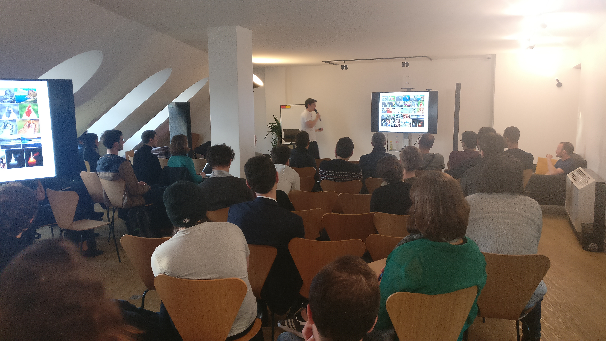
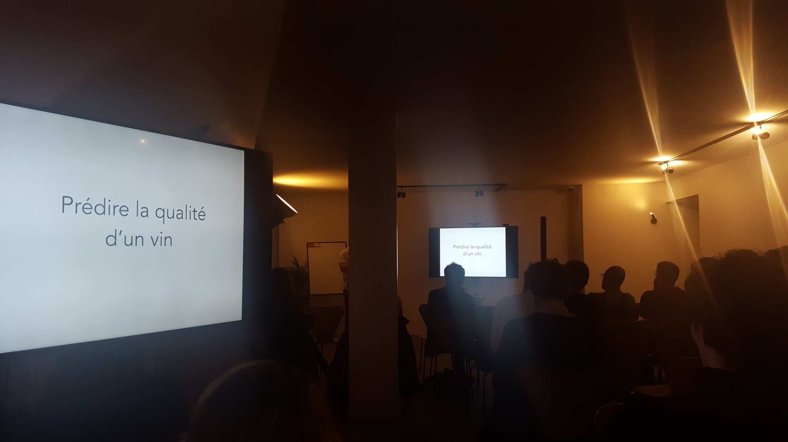

Mercredi 28 mars, c'était le tout premier épisode de **Code It Up**, les Meetups de Coddity.

Ce **Deus Ex Machine Learning** était animé par Jérémy, notre lead data scientist avec un objectif simple : **démystifier la data science et le machine learning** !

Jérémy a présenté à la quarantaine de participants les notions de base permettant de comprendre comment exploiter sa data et la transformer en avantage concurrentiel : **algorithme**, **modèles** et **apprentissage**.

Evidemment, Coddity oblige, Jérémy a choisi un projet fil rouge pertinent pour toute la présentation : **Prédire la qualité d'un vin avec du Machine Learning** !

Pour connaître la suite du programme :
[Code-it-up sur Meetup](https://www.meetup.com/fr-FR/meetup-group-DuTVWGjV)
