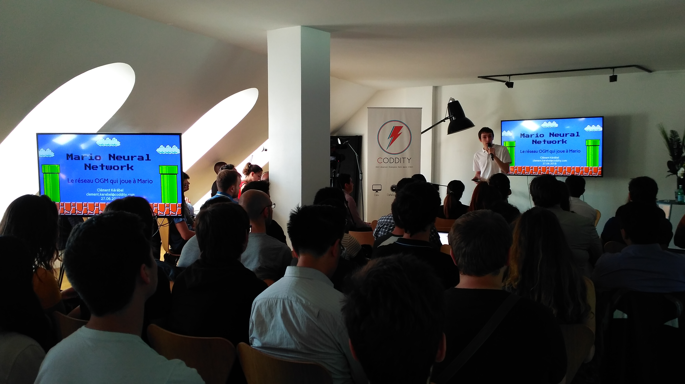
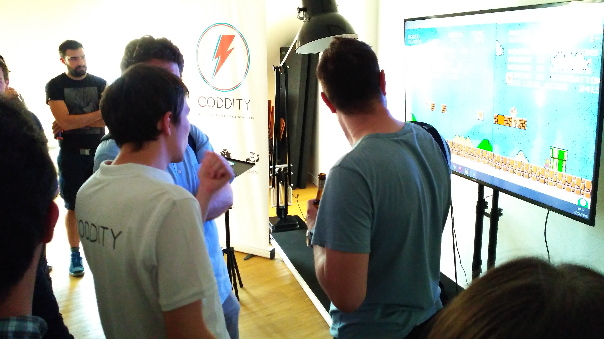
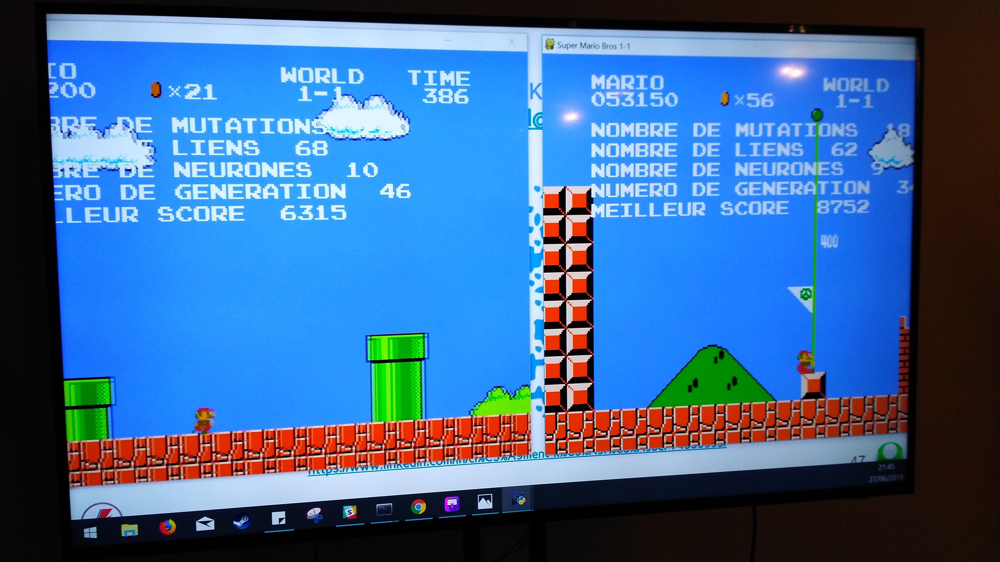
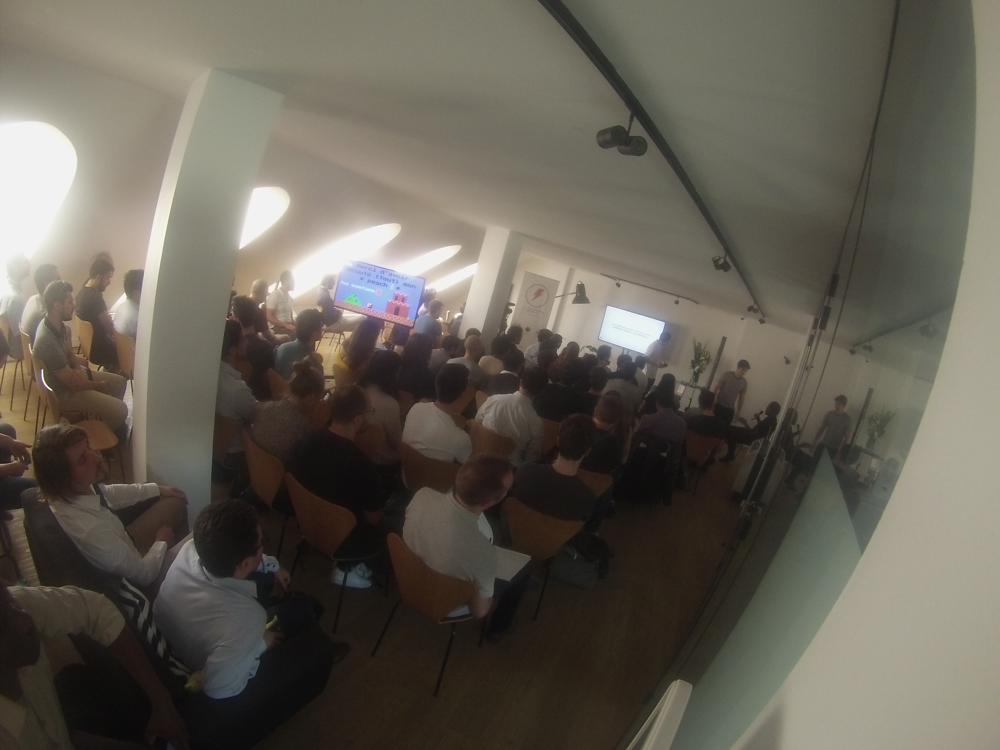
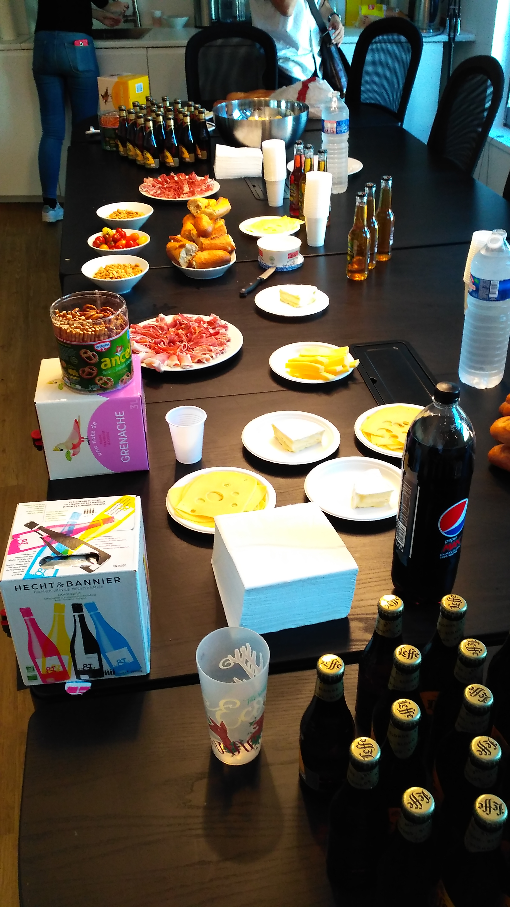

Le 27 juin nous organisions notre deuxième meetup "Code It Up" qui portait sur un immense problème existentiel : **faire en sorte que Mario termine le premier niveau de Super Mario Bros 1 sans intervention humaine**. 

C'est un membre de l'équipe Data de Coddity, Clément, qui a imaginé le projet et porté sa réalisation, avec au programme l'utilisation d'algorithmes génétiques pour optimiser des réseaux de neurones. **Biologie, théorie de l'évolution, deep learning et jeux 8-bits** font plutot bon ménage !

Note : l'article détaillant le projet complet est [ici](https://blog.coddity.com/article/mario-neural-network)

Clément s'est prêté à l'exercice du talk pour nous exposer pendant près d'1h sa démarche et les résultats obtenus, avant de passer évidemment à la phase de démo pendant l'apéro. 
Regarder 4 Marios avancer tous seuls, se prendre des tuyaux et sauter dans le vide un verre à la main est sans doute un plaisir de fin gourmet.

Merci aux 120 personnes présentes ce soir-là, nous espérons vous voir aux prochaines éditions !

D'ailleurs, pour connaître la suite du programme : 
[Code-it-up sur Meetup](https://www.meetup.com/fr-FR/meetup-group-DuTVWGjV)

Quelques photos bonus :

