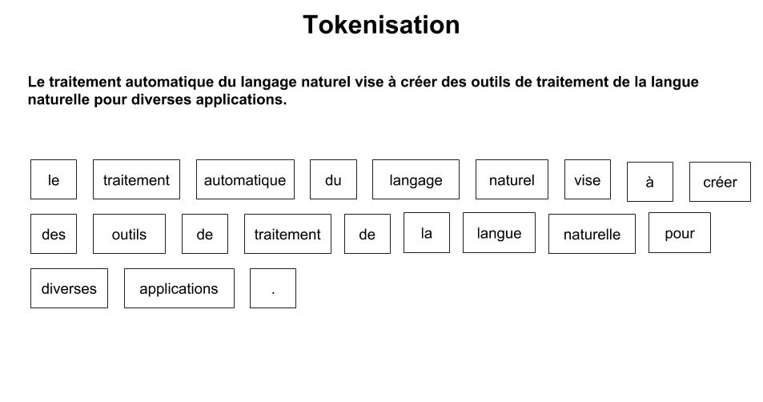
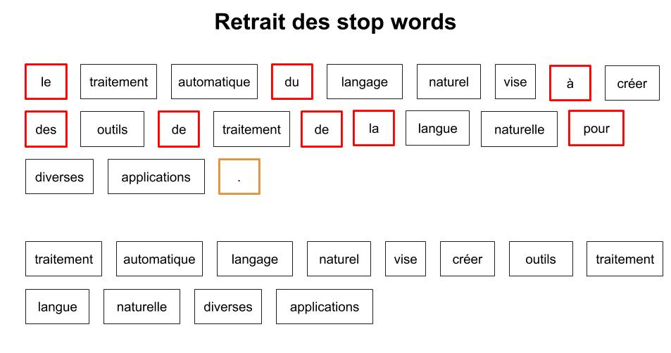
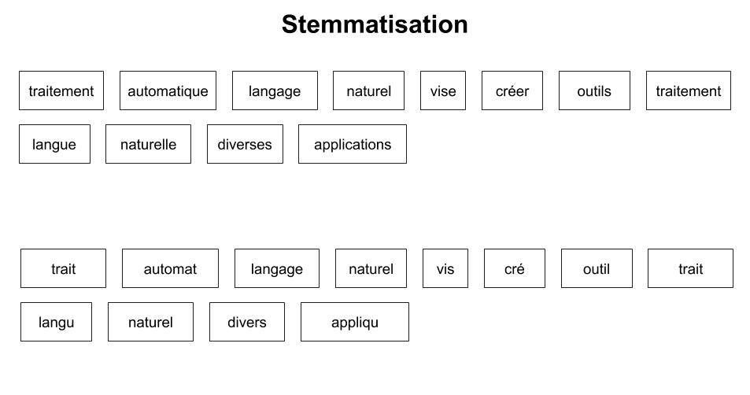
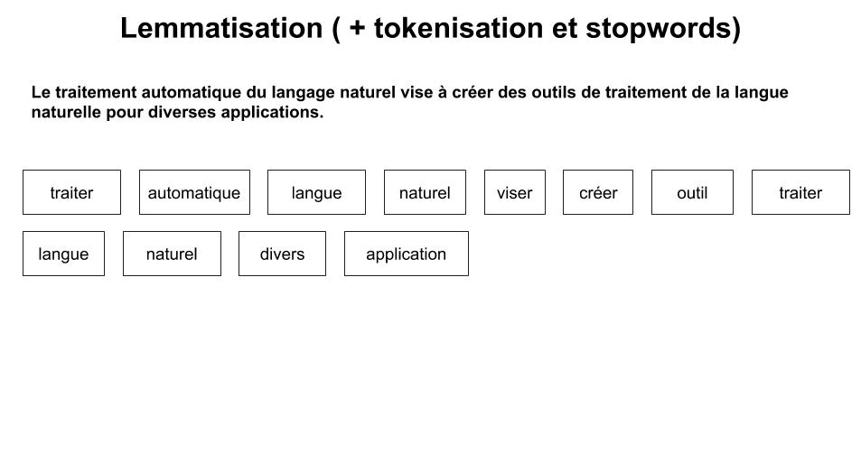
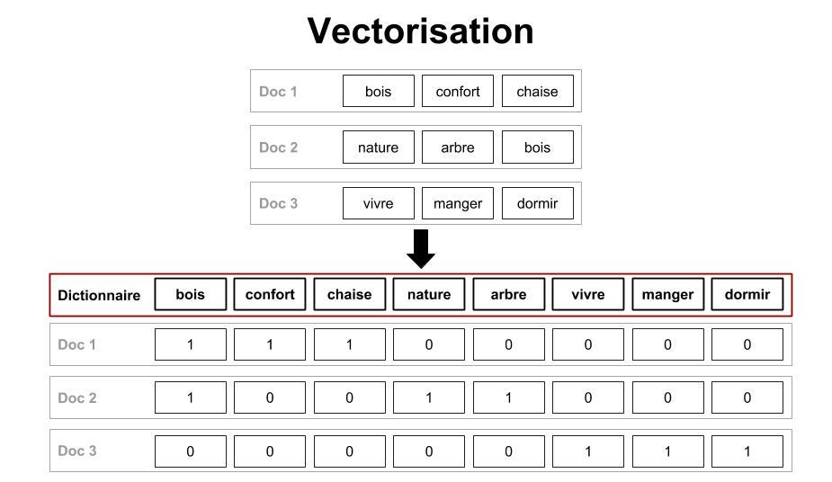
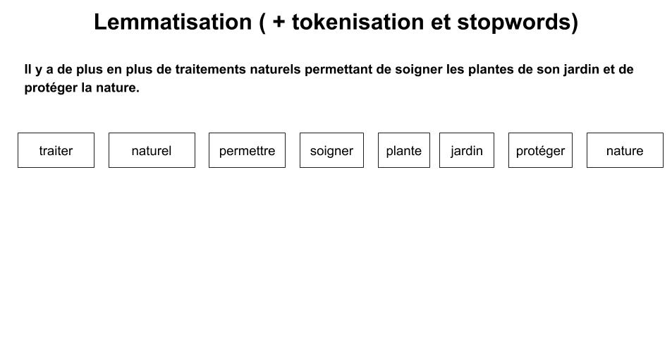

# Introduction au NLP : le traitement de texte automatisé

Chaque seconde, nous produisons une grande quantité de données (29’000 Gigaoctets rien que sur le web). Une grande partie est du texte: un tweet sur twitter, un post sur facebook, un article medium, un compte-rendu de réunion, un formulaire de satisfaction client etc.

Ces données textuelles qui nous entourent contiennent des informations qui peuvent apporter une grande valeur à un business - si toutefois elles sont décryptées par un ordinateur. Cela peut me permettre de :
-   Découvrir ce que mes clients et utilisateurs pensent de mon produit et détecter leurs attentes ;
-   Classer automatiquement mes documents pour pouvoir plus facilement les retrouver ou les stocker ;
-   Générer des résumés de contenus textuels.

Extraire et manipuler automatiquement du texte est donc un enjeu stratégique qui apporte un avantage concurrentiel fort.

  

Comment faire en sorte qu’une machine comprenne du texte et comment en extraire de la connaissance ?

Un ordinateur ne comprend pas le français comme un humain pourrait le faire. Les mots n’ont pas de sens pour une machine. Il faut donc des moyens spécifiques pour les exploiter et les manipuler. C’est cette problématique de compréhension du texte qu’adresse le NLP. Néanmoins, avant d'être utilisable, ce type de données doit subir un prétraitement. C’est cette étape que nous présentons dans cet article.

En effet, un mot peut être écrit de différentes façons (singulier, pluriel, accords, conjugaison des verbes) mais aussi avoir différentes significations en fonction du contexte (avions : verbe avoir ou nom pluriel avions). On peut également trouver des fautes d’orthographe qui rendent les mots indescriptibles pour un ordinateur. Enfin, chaque langue est différente, et peut donc nécessiter des aménagements dans les traitements réalisés.

Nous appliquons donc un ensemble d’actions qui se décomposent en deux phases majeurs :

-   La première a pour objectif **de réduire un document à une série de mots les plus représentatifs du texte.** Elle extrait ainsi l’information contenue dans le document.
    
-   La seconde utilise ces mots pour **représenter chaque document sous forme d’un vecteur dans lequel chaque composante correspond à un mot** (par exemple, son nombre d'occurrence).

Le vecteur obtenu est interprétable par la machine, ce qui nous permet ensuite de calculer des distances, de comparer des documents, etc

Ces étapes sont redondantes mais nécessaires. Afin de les illustrer, nous utiliserons la phrase suivante comme exemple tout au long de l’article :

>*“Le traitement automatique du langage naturel vise à créer des outils de traitement de la langue naturelle pour diverses applications.”*

### ETAPE 1 : Passage en minuscule
Dans un premier temps, nous transformons les majuscules en minuscules car les étapes suivantes sont sensibles à la casse : elles considèrent les mots “Bonjour” et “bonjour” comme différents par exemple.

  

### ETAPE 2: Tokenisation

L’étape suivante est la tokenisation. Il s’agit de décomposer une phrase, et donc un document, en tokens. Un token est un élément correspondant à un mot ou une ponctuation, cependant de nombreux cas ne sont pas triviaux à traiter :

-   Les mots avec un trait d’union, exemple : peut être et peut-être qui ont des significations très différentes ;
-   Les dates et heures qui peuvent être séparées par des points, des slashs, des deux points ;
-   Les apostrophes ;
-   Les caractères spéciaux : émoticônes, formules mathématiques.
   
La figure 1 présente la tokenisation pour la phrase d’exemple. Le passage en minuscule est aussi intégré.

Figure 1 : tokenisation

### ETAPE 3: Retrait des stopwords

Ensuite, nous retirons les mots appartenant aux stopwords[ \[1](https://pythonspot.com/nltk-stop-words/),[2\]](https://pypi.org/project/stop-words/). Il s’agit de listes de mots définies au préalable soit par l’utilisateur soit dans des librairies existantes. Ces listes se composent de mots qui n’apportent aucune information, qui sont en général très courants et donc présents dans la plupart des documents, par exemple : je, nous, avoir (le verbe et ses conjugaisons).
La suppression de ces stopwords permet de ne pas polluer les représentations des documents afin qu’elle ne contienne que les mots représentatifs et significatifs. Ce “nettoyage” du texte peut aussi s’accompagner de la suppression d’autres éléments comme les nombres, les dates, la ponctuation etc.

La figure 2 illustre le retrait de ces stopwords ainsi que de la ponctuation.

Figure 2 : retrait des Stopwords

### ETAPE 4 : Groupement sémantique
  
Dès lors, nous disposons pour chaque document d’une liste “nettoyée” de mots porteurs de sens et séparés en tokens. Mais un mot peut être écrit au pluriel, au singulier ou avec différents accords et les verbes peuvent être conjugués à différents temps et personnes.

Nous devons donc réduire les différences grammaticales des mots en trouvant des formes communes. Pour ce faire, nous disposons de deux méthodes distinctes :
-   La stemmatisation, qui ne prend pas en compte le contexte de la phrase
-   La lemmatisation, qui prend en compte le contexte
  
#### ETAPE 4.1 : La stemmatisation

La stemmatisation (ou racinisation) réduit les mots à leur radical ou racine. Le résultat n’est pas forcément un mot existant, comme vous pouvez le constater dans notre phrase d’exemple (cf. figure 3. stemmatisation). Cependant, celle-ci peut parfois réduire deux mots à l’orthographe proche, mais aux sens différents, à une même racine.

Figure 3 : stemmatisation

Les algorithmes de stemmatisation dépendent de la langue. Il en existe de nombreux et ils sont plus ou moins performants en fonction de la complexité de celle-ci. Les plus connus sont le Snowball de Martin Porter qui est décliné pour différentes langues dont le français, et l’algorithme Carry créé spécifiquement pour le Français.

#### ETAPE 4.2 : La Lemmatisation

La lemmatisation, qui prend en considération le contexte dans lequel le mot est écrit, a pour but de trouver la forme canonique du mot, le lemme. Par conséquent, elle doit se faire après la transformation des lettres majuscules en minuscules et avant la tokenisation car les mots présents avant et après sont importants pour déterminer la nature du mot.

Le lemme correspond à l’infinitif des verbes et à la forme au masculin singulier des noms, adjectifs et articles. Par exemple cette méthode est capable de faire la différence entre “nous avions” : verbe avoir et “les avions” : le pluriel d’un avion. La lemmatisation de la phrase d’exemple est présentée dans la figure suivante.

Figure 4 : lemmatisation

En conclusion, la stemmatisation peut être considérée comme une forme brute et rapide alors que la lemmatisation tente de garder au maximum le sens des phrases.

Quelle que soit la méthode choisie (stemmatisation ou lemmatisation) nous sommes maintenant en possession de mots utiles et réduits pour chaque document. Ils constituent ce qu'on appelle le dictionnaire du document à analyser. Nous souhaitons pouvoir les comparer les uns par rapports aux autres : parlent-ils du même sujet ? Ont-ils un contenu similaire ?

### ETAPE 5 : Le Bag of Word (BoW)
  
Ici, nous souhaitons représenter un document par un vecteur. Pour cela, on fait correspondre chaque composante du vecteur-document à un mot du dictionnaire du corpus. Une composante contient donc une valeur pour chacun des mots existant dans l’ensemble des textes que nous traitons. Cette valeur peut être, par exemple, le nombre d'occurrences du mot dans le document. Si un mot n’y est pas présent on lui donnera la valeur 0. Il s’agit d’une approche dite de bag of word. La figure suivante illustre la vectorisation :

Figure 5 : vectorisation

Cependant d’autres approches sont possibles et permettent d'être plus pertinent sur la représentation de nos documents. Elles se basent sur les hypothèses suivantes :

-   Plus le mot est présent dans un grand nombre de documents, moins il apporte d’information permettant de les distinguer
-   Un mot présent dans peu de document permet de bien les caractériser
-   Plus un mot est présent dans un document, plus il a de poids dans ce document.

### ETAPE 6 : Calcul du TF-IDF

A partir de ces hypothèses, on peut calculer le TF-IDF. Cet acronyme anglais correspond à un poids calculé et affecté pour chaque mot de chaque document du corpus. Il se décompose en deux parties :

-   La fréquence d’apparition d’un mot dans un document
-   Le nombre de document dans lequel le mot apparaît une fois ou plus par rapport au nombre de document total.
    
La combinaison de ces deux indicateurs donne le TF-IDF. Ce score présente l’importance d’un mot dans un document et prend en compte sa rareté dans l’ensemble du corpus. Les termes les moins présents dans le corpus ont donc un poids plus important car ils sont plus discriminants. On peut donc utiliser ce score comme valeur des vecteurs représentant nos documents. Le tableau en annexe illustre ces calculs.

### ETAPE 7 : Réduction de la taille des vecteurs obtenus

Les vecteurs obtenus dans le bag of words classique ou le TF-IDF ont la taille du vocabulaire du corpus. Ils peut être intéressant, afin de limiter le temps de calcul et le stockage, de limiter cette taille. Pour ce faire, on peut :

-   Éliminer les mots non discriminants, c’est à dire ceux qui ont un TF-IDF trop faible dans l’ensemble du corpus ;
-   Définir des bornes correspondant au nombre de documents maximum et minimum dans lequel un mot doit se trouver pour être gardé dans le vocabulaire ;
-   Utiliser des méthodes algorithmiques de réduction de dimensions (MDS par exemple).
    
Ces vecteurs réduits nous permettent d’améliorer les performances d’outils de Machine Learning utilisés par la suite car ils limitent le bruit présent dans les données.

Pour résumer, nous avons vu les différentes étapes nécessaires au traitement des données textuelles afin de les rendre utilisables. Elles permettent d’obtenir des représentations vectorielles des documents, exploitables dans la suite des processus de NLP. Ce prétraitement est aussi appliqué dans le cadre de projets d’indexation et d'interrogation de base de textes. Bien entendu, différentes méthodes de vectorisation existent, par exemple les méthodes [d’embedding](https://en.wikipedia.org/wiki/Word_embedding), ou des approches basées sur du [deep learning](http://www.wildml.com/2015/12/implementing-a-cnn-for-text-classification-in-tensorflow/). Pour ces méthodes aussi, le nettoyage du texte est nécessaire. A partir des résultats de ce processus, nous allons pouvoir clusteriser ou classifier du texte afin d’en extraire de la valeur et des informations en étudiant leur proximité et les regrouper selon leurs sujets, leurs auteurs, etc.

Chez Coddity, nous avons développé une plateforme qui accélère le pré-traitement de bases documentaires. Nous gagnons ainsi du temps sur cette phase de préparation redondante !
Les applications sont multiples : structuration de base documentaire, indexation pour moteur de recherche, recommandations de contenus similaires, préparation à l’analyse de sentiments, etc.

# Annexe

  ### Calcul du TF-IDF :
Pour le calcul, on utilisera une seconde phrase lemmatisée dans la figure ci-dessous.

Figure 6 : lemmatisation exemple 2

-   Le TF correspond à la fréquence d’apparition des termes dans un document
-   L’IDF correspond à l’importance du mot dans le corpus

| Lemme	 | TF phrase 1 | TF phrase 2 | IDF | TF-IDF phrase 1 | TF-IDF phrase 2 |
|--|--|--|--|--|--|
| traiter |2/12  |  1/8|  0|  0|  0| 
| automatique| 1/12 |  0|  0.7|  0.06|  0| 
| langue|  2/12|  0|  0.7|  0.12|  0| 
| naturel| 2/12 |  1/8|  0|  0|  0| 
| viser|  1/12|  0|  0.7|  0.06|  0| 
| créer|  1/12|  0|  0.7|  0.06|  0| 
| outil|  1/12|  0|  0.7|  0.06|  0| 
| divers|  1/12|  0| 0.7|  0.06|  0| 
| application|  1/12|  0|  0.7|  0.06|  0| 
| permettre|  0|  1/8|  0.7|  0|  0.08| 
| soigner|  0|  1/8|  0.7|  0|  0.08| 
| plante|  0|  1/8|  0.7|  0|  0.08| 
| jardin|  0|  1/8|  0.7|  0|  0.08| 
| protéger|  0|  1/8|  0.7|  0|  0.08|
| nature|  0|  1/8|  0.7|  0|  0.08|

